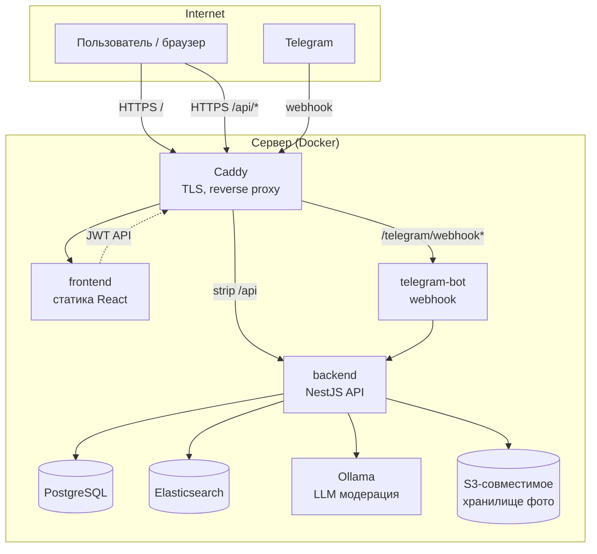
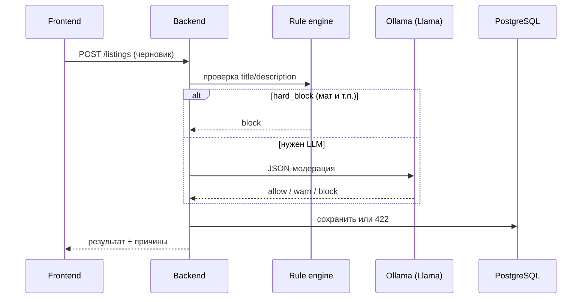

# Rento — платформа для аренды вещей

**Rento** — веб-платформа для безопасной аренды вещей между пользователями: каталог объявлений, бронирование, оплата, верификация и модерация контента.

Монорепозиторий: **NestJS** (API) + **React** (веб-клиент) + **Telegram Bot** (вход через Telegram) + общие типы в пакете **shared**.


## Материалы и артефакты

| Ресурс                     | Ссылка                                                                                                            |
| -------------------------- | ----------------------------------------------------------------------------------------------------------------- |
| Документация (Google Docs) | [О-23-ИСП-2-СПО — документ](https://docs.google.com/document/d/1RW9IpYSdksEtEWKxD4l4UHHZKeqMb_QzlF8XSnzcMGQ/edit) |
| Документация в репозитории | [docs/README.md](docs/README.md)                                                                                  |
| Дизайн (Figma)             | [Rento — макеты](https://www.figma.com/design/oBB3tKDgPnpHQt9vAnei7I/Rento)                                       |
| Задачи (Trello)            | [Rento — доска](https://trello.com/b/FZHRKeAm/rento)                                                              |
| OpenAPI (в репозитории)    | [docs/openAPI.yaml](docs/openAPI.yaml)                                                                            |
| Диаграммы и состояния      | [docs/sequence/](docs/sequence/), [docs/state/](docs/state/)                                                      |
| Деплой (production)        | [deploy/README.md](deploy/README.md)                                                                              |
| Модерация текста (LLM)     | [docs/moderation-draft-ai.md](docs/moderation-draft-ai.md)                                                        |

---

## О проекте

Пользователь может:

- зарегистрироваться по email или через **Telegram**;
- создать объявление (черновик → модерация → публикация);
- искать вещи в каталоге с фильтрами и полнотекстовым поиском;
- бронировать срок аренды, привязывать способ оплаты;
- проходить верификацию личности и накапливать **trust score**.

Репозиторий организован как **npm workspaces** в каталоге `packages/`. Корень репозитория содержит Husky, commitlint и общий CI.

### Особенности репозитория

- изолированные пакеты `backend`, `frontend`, `shared`; отдельный сервис `telegram-bot` (сборка из `packages/`, не в workspaces);
- TypeScript во всех пакетах;
- CI на GitHub Actions: [.github/workflows/ci.yml](.github/workflows/ci.yml);
- production-деплой по ветке `deploy`: [.github/workflows/](.github/workflows/);
- соглашение о коммитах: [Conventional Commits](https://www.conventionalcommits.org/ru/v1.0.0/).

---

## Архитектура системы

### Общая схема (production)

В продакшене всё поднимается через **Docker Compose** в каталоге `deploy/`. Снаружи доступен только **Caddy** (HTTPS, 80/443); база и Elasticsearch — во внутренней сети.



| Компонент         | Роль                                                                                                                     |
| ----------------- | ------------------------------------------------------------------------------------------------------------------------ |
| **Caddy**         | Единая точка входа: `https://$DOMAIN/` → фронт, `https://$DOMAIN/api/*` → backend:3000, webhook бота → telegram-bot:3010 |
| **frontend**      | SPA на React; собранный бандл отдаётся как статика                                                                       |
| **backend**       | REST API, бизнес-логика, Prisma, индексация в ES, модерация, почта, геокодер                                             |
| **telegram-bot**  | Подтверждение входа через Telegram, webhook от Telegram API                                                              |
| **postgres**      | Источник истины: пользователи, объявления, бронирования, категории                                                       |
| **elasticsearch** | Полнотекстовый поиск и автодополнение по каталогу                                                                        |
| **ollama**        | Локальный LLM для модерации текста объявлений (опционально отключается флагами)                                          |

Сети Docker: **`web`** (доступ в интернет для Caddy, Ollama pull) и **`internal`** (изолированная; postgres, elasticsearch, backend ↔ postgres).

### Локальная разработка

На машине разработчика обычно:

- `packages/backend` + `packages/frontend` — `npm run dev` (порты **3000** и **5173**);
- Postgres + Elasticsearch — `packages/backend/docker-compose.dev.yml` (Postgres на **5434**, ES на **9200**, Ollama на **11435**);
- Telegram-bot — отдельно, с туннелем (ngrok/cloudflared) для webhook или polling (см. [packages/telegram-bot/README.md](packages/telegram-bot/README.md)).

### Потоки данных (ключевые сценарии)

#### Каталог и поиск

1. Фронт вызывает `GET /search` (и `GET /search/autocomplete`).
2. Backend ищет в **Elasticsearch** (индекс `rento-listings` по умолчанию).
3. Найденные `listingId` **гидратируются** из **PostgreSQL** (актуальные цены, фото, категория).
4. При пустой выдаче в ответ добавляются `popularCategories` (активные категории из БД).
5. При публикации объявления (`POST /listings/:id/publish`) документ индексируется в ES; полный пересчёт: `npm run search:reindex` в backend.

> **Важно:** PostgreSQL и Elasticsearch должны быть согласованы. После ручной чистки БД на сервере нужно также очистить или переиндексировать ES (см. [deploy/README.md](deploy/README.md) и `packages/backend/README.md`).

Демо-объявления (Ninebot / Makita / GoPro) **отключены по умолчанию** (`CATALOG_DEFAULT_SEED_ENABLED=false`). Включение только явно для dev/демо.

#### Создание объявления и модерация



Подробности: [docs/moderation-draft-ai.md](docs/moderation-draft-ai.md). Health-check LLM: `GET /health/moderation-llm` (опционально `?inference=1`).

#### Вход через Telegram

1. Браузер: `POST /telegram/login/start` → `deepLink`.
2. Пользователь открывает бота → бот вызывает `POST /telegram/login/confirm` (заголовок `x-bot-secret`).
3. Бот отдаёт одноразовый `code` → браузер: `POST /telegram/login/exchange` → JWT access/refresh.

Сервис бота: [packages/telegram-bot/README.md](packages/telegram-bot/README.md).

#### Бронирования и платежи

- Календарь доступности объявления, создание брони, статусы (`PENDING` → `CONFIRMED` → `ACTIVE` → `COMPLETED` и др.) — модуль `bookings`, схема в Prisma.
- Способы оплаты и холды — модули `payment-methods`, `payments-hold` (интеграции уточняйте по OpenAPI и контроллерам).

### Доменная модель (кратко)

Основные сущности в `packages/backend/prisma/schema.prisma`:

| Сущность                 | Назначение                                                                      |
| ------------------------ | ------------------------------------------------------------------------------- |
| **User**                 | Аккаунт, роль, статус (email/Telegram), адрес, trust score                      |
| **Listing**              | Объявление: черновик / модерация / активное / архив                             |
| **Category**             | Категории каталога (в проде — 7 фиксированных типов «Для ремонта», …, «Разное») |
| **Booking**              | Бронирование между арендатором и владельцем                                     |
| **IdentityVerification** | Верификация через ЕСИА (провайдер настраивается)                                |
| **TrustScore**           | Репутационный балл пользователя                                                 |

Диаграммы состояний: [docs/state/](docs/state/). Схема БД: [docs/architectureOfDB/](docs/architectureOfDB/).

---

## Технологический стек

### Сводная таблица

| Слой         | Технологии                                                        | Назначение                                            |
| ------------ | ----------------------------------------------------------------- | ----------------------------------------------------- |
| **Язык**     | TypeScript 5.x                                                    | Единый язык во всех пакетах                           |
| **API**      | NestJS 11, class-validator, JWT                                   | REST, модули, guards, scheduled jobs                  |
| **ORM / БД** | Prisma 7, PostgreSQL 16                                           | Миграции, типобезопасный доступ к данным              |
| **Поиск**    | Elasticsearch 8.11, `@elastic/elasticsearch`                      | Полнотекст, сортировки, geo (при наличии координат)   |
| **Файлы**    | AWS SDK v3 (S3 API)                                               | Фото объявлений (MinIO, Yandex Object Storage и т.п.) |
| **LLM**      | Ollama + Llama (модель из `MODERATION_LLM_MODEL`)                 | Модерация title/description                           |
| **Клиент**   | React 19, React Router 7, Vite 6                                  | SPA, маршрутизация, сборка                            |
| **Тесты**    | Jest (backend), Vitest + Testing Library (frontend)               | Unit / интеграционные                                 |
| **Качество** | ESLint, Prettier, Husky, commitlint                               | Линт, pre-commit                                      |
| **Деплой**   | Docker Compose, Caddy 2                                           | Production на VPS                                     |
| **CI/CD**    | GitHub Actions                                                    | Lint/test → SSH deploy на `deploy`                    |
| **Бот**      | grammY / Telegraf-подобный стек (см. `telegram-bot/package.json`) | Webhook, связка с backend                             |

### Backend — модули NestJS

Точка входа: `packages/backend/src/app.module.ts`.

| Модуль                              | Ответственность                                          |
| ----------------------------------- | -------------------------------------------------------- |
| `auth`                              | JWT, refresh, регистрация, сессии                        |
| `users`                             | Профиль, публичные карточки пользователей                |
| `listings`                          | CRUD объявлений, фото (S3), публикация                   |
| `search`                            | `GET /search`, autocomplete, индекс ES                   |
| `calendar`                          | Доступность объявления, ручные блоки дат                 |
| `bookings`                          | Бронирования, смена статусов                             |
| `payment-methods` / `payments-hold` | Оплата и холды                                           |
| `moderation`                        | Rule engine + Ollama, health LLM                         |
| `verification`                      | Верификация личности                                     |
| `trust-score`                       | Внутренний API репутации                                 |
| `geo`                               | Геокодирование (Yandex Geocoder, ключ только на сервере) |
| `notifications`                     | Уведомления (email и др.)                                |

При расхождении с [docs/openAPI.yaml](docs/openAPI.yaml) приоритет у **фактических маршрутов** в `**/*.controller.ts`.

### Frontend

- `packages/frontend/src/App.tsx` — маршруты: каталог `/`, объявление `/listings/:id`, создание `/create-item`, профиль, бронирования, гид `/guide`.
- API-клиент: `VITE_API_BASE_URL` (в dev обычно `http://localhost:3000`).
- Общие типы с API: импорт из `@rento/shared`.

### Пакет `shared`

`packages/shared` — интерфейсы DTO (`IListing`, `ICategory`, …), собирается `tsc` → `dist/`. Подключается в backend и frontend как workspace `@rento/shared`.

### Telegram-bot

Отдельный Node-сервис в `packages/telegram-bot/`, не входит в npm workspaces `packages/package.json`, но собирается тем же Docker-контекстом `../packages`. В production проксируется Caddy на путь `/telegram/webhook*`.

---

## Структура репозитория

```text
Rento/
├── packages/
│   ├── backend/           # NestJS API, Prisma, docker-compose.dev.yml
│   ├── frontend/          # React + Vite
│   ├── shared/            # общие TypeScript-типы
│   ├── telegram-bot/      # сервис Telegram (логин/регистрация)
│   └── package.json       # workspaces: backend, frontend, shared
├── deploy/                # production: docker-compose.yml, Caddyfile, .env
├── docs/                  # OpenAPI, sequence/state, модерация, S3
├── .github/               # CI, CD, шаблоны PR/issues
├── package.json           # Husky / commitlint (корень)
└── README.md              # этот файл
```

---

## Быстрый старт

### Требования

- [Node.js](https://nodejs.org/) **22.x** (как в CI; требование цепочки Prisma 7) или новее
- [npm](https://docs.npmjs.com/cli/v10/commands/npm) **9+**
- для локального API: [Docker Engine](https://docs.docker.com/engine/) + Docker Compose (см. `packages/backend/docker-compose.dev.yml`)

### Установка зависимостей

Рабочая область npm — каталог **`packages/`**.

```bash
git clone https://github.com/Rento-team/Rento.git
cd Rento/packages
npm install
```

Опционально, из **корня** репозитория (`Rento/`), для Husky и commitlint:

```bash
cd Rento
npm install
```

### База данных, поиск и Ollama (Docker)

Из каталога `packages/backend`:

```bash
docker compose -f docker-compose.dev.yml up -d
npx prisma migrate deploy
```

- Postgres: порт **5434** на хосте
- Elasticsearch: **http://localhost:9200**
- Ollama (модерация): **http://localhost:11435** — см. [docs/moderation-draft-ai.md](docs/moderation-draft-ai.md)

Скопируйте `packages/backend/.env.example` → `.env`.

### Разработка

Из каталога `packages/`:

```bash
npm run dev
```

- API: [http://localhost:3000](http://localhost:3000)
- фронтенд: [http://localhost:5173](http://localhost:5173)

Отдельно:

```bash
npm run dev:backend
npm run dev:frontend
```

### Сборка и проверки

```bash
npm run build
npm run build:backend
npm run build:frontend
npm run lint
npm run lint:all
npm run test
npm run clean
```

### Полезные команды backend

| Команда                       | Описание                                                    |
| ----------------------------- | ----------------------------------------------------------- |
| `npm run db:reset-categories` | Очистка объявлений и вставка 7 категорий (только dev/админ) |
| `npm run search:reindex`      | Переиндексация активных объявлений в Elasticsearch          |
| `npm run seed:demo-listing`   | Одно демо-объявление для локальной разработки               |

Подробнее: [packages/backend/README.md](packages/backend/README.md).

---

## Команды в `packages/`

| Команда                                    | Описание                             |
| ------------------------------------------ | ------------------------------------ |
| `npm run dev`                              | dev-серверы backend + frontend       |
| `npm run dev:backend`                      | только NestJS (`nest start --watch`) |
| `npm run dev:frontend`                     | только Vite                          |
| `npm run build`                            | сборка всех воркспейсов              |
| `npm run build:backend` / `build:frontend` | выборочная сборка                    |
| `npm run lint`                             | как в CI: shared + frontend          |
| `npm run lint:all`                         | ESLint во всех пакетах               |
| `npm run test`                             | тесты во всех воркспейсах            |
| `npm run clean`                            | очистка артефактов                   |

---

## Переменные окружения

| Окружение          | Файл                           | Что настроить                                                                               |
| ------------------ | ------------------------------ | ------------------------------------------------------------------------------------------- |
| Локальный backend  | `packages/backend/.env`        | `DATABASE_URL`, JWT, SMTP, S3, `ELASTICSEARCH_*`, `MODERATION_*`, `YANDEX_GEOCODER_API_KEY` |
| Локальный frontend | `packages/frontend/.env.local` | `VITE_API_BASE_URL`                                                                         |
| Production         | `deploy/.env`                  | домен, секреты, `POSTGRES_*`, `BOT_TOKEN`, ключи S3, модель Ollama                          |

В Docker production `DATABASE_URL` собирается в `deploy/docker-compose.yml` из `POSTGRES_*`. Для Ollama внутри сети: `MODERATION_LLM_BASE_URL=http://ollama:11434`, не `localhost`.

Шаблоны: `packages/backend/.env.example`, `packages/frontend/.env.example`, `deploy/.env` (создаётся вручную на сервере).

---

## Деплой (кратко)

Полная инструкция: **[deploy/README.md](deploy/README.md)**.

```bash
# на сервере, из клона репозитория
docker compose -f deploy/docker-compose.yml up -d --build
docker compose -f deploy/docker-compose.yml run --rm backend npx prisma migrate deploy
```

Пересоздать только Telegram-бота:

```bash
docker compose -f deploy/docker-compose.yml build telegram-bot
docker compose -f deploy/docker-compose.yml up -d --force-recreate telegram-bot
```

Ветка **`deploy`** → GitHub Actions → SSH на сервер → `git pull` + `docker compose up`.

---

## Документация по инструментам

| Область                 | Документация                                                                           |
| ----------------------- | -------------------------------------------------------------------------------------- |
| NestJS                  | https://docs.nestjs.com/                                                               |
| Prisma                  | https://www.prisma.io/docs                                                             |
| Elasticsearch JS client | https://www.elastic.co/guide/en/elasticsearch/client/javascript-api/current/index.html |
| React                   | https://react.dev/                                                                     |
| Vite                    | https://vite.dev/guide/                                                                |
| React Router            | https://reactrouter.com/                                                               |
| AWS SDK S3              | https://docs.aws.amazon.com/AWSJavaScriptSDK/v3/latest/client/s3/                      |

---

## Соглашение о коммитах

Используется стиль [Conventional Commits](https://www.conventionalcommits.org/ru/v1.0.0/). Формат:

```text
<тип>[необязательная область]: краткое описание

[пустая строка]

[необязательно — подробности]
```

### Часто используемые типы

| Тип        | Простыми словами                           |
| ---------- | ------------------------------------------ |
| `feat`     | Новая возможность для пользователя или API |
| `fix`      | Исправление бага                           |
| `docs`     | Только документация                        |
| `style`    | Форматирование без смены логики            |
| `refactor` | Перестройка кода без новой фичи            |
| `perf`     | Ускорение или снижение нагрузки            |
| `test`     | Тесты                                      |
| `build`    | Сборка, зависимости, CI                    |
| `ci`       | GitHub Actions                             |
| `chore`    | Рутина                                     |
| `revert`   | Откат коммита                              |

Примеры:

```text
feat(frontend): добавить страницу списка объявлений
fix(backend): корректно валидировать даты бронирования
docs: описать архитектуру в README
```

Проверка: **commitlint** + **Husky** в корне ([.commitlintrc.json](.commitlintrc.json)).

---

## Команда

| Роль             | Имя             |
| ---------------- | --------------- |
| Delivery Manager | Карпеко А.С.    |
| Tester           | Антонов А.Д.    |
| Backender        | Ким А.А.        |
| Frontender       | Луговая Д.А.    |
| Analytic         | Мельникова К.А. |
| Designer         | Рыбаков Д.С.    |
| Backender        | Терещенков К.А. |
| Tester           | Фомичева А.С.   |

---

## Куда смотреть новому участнику

1. Этот README — обзор архитектуры и стека.
2. [docs/README.md](docs/README.md) — указатель артефактов (OpenAPI, диаграммы).
3. [packages/backend/README.md](packages/backend/README.md) — API, поиск, геокодер, env.
4. [deploy/README.md](deploy/README.md) — production, Ollama, секреты GitHub Actions.
5. Контроллеры в `packages/backend/src/**/*.controller.ts` — актуальные HTTP-маршруты.
