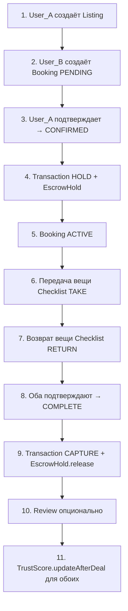

# 🏠 Доменная модель платформы аренды

**Полная, красивая и структурированная документация доменной модели**  
*Airbnb-подобная система с эскроу, модерацией и ИИ-функциями (ARS)*

---

## 📋 Общая структура

Диаграмма разделена на **4 логических модуля**, соответствующих функциональным требованиям:

| Модуль          | Классы                                             | Назначение |
|-----------------|----------------------------------------------------|------------|
| **Core**        | `User`, `Listing`, `Booking`, `Category`, `Review`, `Chat` | Основные бизнес-сущности |
| **Transaction** | `Transaction`, `EscrowHold`, `BankCard`            | Финансы и безопасная сделка (Escrow) |
| **Moderation**  | `Dispute`, `Report`, `Moderator`, `ModerationLog`  | Модерация и споры |
| **AI**          | `TrustScore`, `Recommendation`, `SearchQuery` | ИИ-функции (ARS и рекомендации) |

---

## 1. Модуль Core — Базовые сущности

### `User` (Пользователь)
**Центральная сущность системы.**

**Хранит:**
- Учётные данные: `email`, `phone`, `passwordHash`
- Статус: `ACTIVE` | `SUSPENDED` | `BANNED`
- Роль: `USER` | `MODERATOR` | `ADMIN`

**Связи:**
- Создаёт объявления → `Listing`
- Берёт в аренду → `Booking` (как `renter`)
- Сдаёт в аренду → `Booking` (как `owner`)
- Пишет и получает отзывы → `Review`
- Имеет `TrustScore` (1:1)
- Привязывает `BankCard`

### `Listing` (Объявление)
Карточка товара для аренды.

**Поля:**
- `title`, `description`
- Цены: `pricePerDay`, `pricePerWeek`, `pricePerMonth`
- Залог: `depositAmount`
- Статус: `DRAFT` → `PENDING_MODERATION` → `ACTIVE` → `ARCHIVED`

**Связи:**
- Принадлежит одной `Category`
- До 10 фото → `ListingPhoto`
- Календарь доступности → `ListingAvailability`
- Получает бронирования → `Booking`

### `Booking` (Бронирование)
**Ключевая сущность сделки.**

**Поля:**
- Даты: `startDate`, `endDate`
- Суммы: `rentAmount`, `depositAmount`, `totalAmount`
- Статусы: `PENDING` → `CONFIRMED` → `ACTIVE` → `COMPLETED`

**Связи:**
- Одно `Listing`
- Два участника: `renter` и `owner`
- Создаёт `Transaction`
- Имеет `Chat`
- Может породить `Dispute`
- Может получить `Review`

### `Chat` и `ChatMessage`
Внутренний чат для обсуждения сделки.

- Привязан строго к `Booking`
- `ChatMessage` содержит текст + медиа
- `fraudProbability` — оценка ИИ на мошенничество (FR-503)

---

## 2. Модуль Transaction — Безопасная сделка (Escrow)

### `Transaction`
Финансовая операция.

**Типы:** `HOLD` | `CAPTURE` | `RELEASE` | `REFUND` | `PAYOUT`  
**Статус:** `PENDING` → `PROCESSING` → `SUCCESS`

### `EscrowHold` — Счёт условного депонирования
- Блокирует `rentAmount + depositAmount`
- Статусы: `HELD` → `PARTIALLY_RELEASED` → `FULLY_RELEASED`
- Автоматический возврат залога через 24 часа (FR-404)

### `BankCard`
- Хранит токен (PCI DSS)
- Поля: `last4`, `isDefault`
- Может быть основной картой пользователя

---

## 3. Модуль Moderation — Модерация и споры

### `Moderator`
Наследуется от `User`  
**Уровень:** `JUNIOR` | `SENIOR` | `LEAD`

### `Dispute` (Спор)
- `initiatorId`, `reason`
- **Статусы:** `OPEN` → `UNDER_REVIEW` → `RESOLVED_*`
- **Типы разрешения:**
  - `FULL_REFUND_RENTER` — полный возврат арендатору
  - `FULL_PAYOUT_OWNER` — полная выплата владельцу
  - `SPLIT` — разделение суммы

### `DisputeEvidence`
**Типы доказательств:**  
`PHOTO` | `VIDEO` | `DOCUMENT` | `CHAT_SCREENSHOT`

### `Report` (Жалоба)
`targetType`: `USER` | `LISTING` | `REVIEW` | `MESSAGE`

### `ModerationLog`
Журнал всех действий модератора:
- `action`: `BLOCK_USER`, `DELETE_LISTING`, `HIDE_REVIEW` и т.д.
- Фиксирует кто, что и почему сделал.

---

## 4. Модуль AI — Интеллектуальные функции

### `TrustScore` (Индекс доверия ARS)
Автоматический расчёт (FR-103, FR-405):

- `currentScore`
- Статистика: `totalDeals`, `successfulDeals`, `lateReturns`, `disputes`
- Методы: `calculate()`, `updateAfterDeal()`

### `Recommendation` (ИИ-рекомендации)
**Типы:** `SIMILAR` | `BEST_CHOICE` | `NEARBY` | `TRENDING`

### `SearchQuery`
История поисковых запросов + применённые фильтры (в формате JSON).

---

## 5. Ключевые связи (Relationships)

### Связи `User`

| Связь                        | Тип          | Описание                              |
|------------------------------|--------------|---------------------------------------|
| `User` → `UserVerification`  | 1 : *        | Несколько способов верификации        |
| `User` → `TrustScore`        | 1 : 1        | Один индекс доверия                   |
| `User` → `BankCard`          | 1 : *        | Несколько привязанных карт            |
| `User` → `Listing`           | 1 : *        | Создаёт объявления                    |
| `User` → `Booking` (renter)  | 1 : *        | Берёт в аренду                        |
| `User` → `Booking` (owner)   | 1 : *        | Сдаёт в аренду                        |
| `User` → `Review` (author)   | 1 : *        | Пишет отзывы                          |
| `User` → `Review` (target)   | 1 : *        | Получает отзывы                       |
| `User` ↔ `Moderator`         | Наследование | Модератор — это пользователь          |

### Связи `Listing`

| Связь                     | Тип   | Описание                  |
|---------------------------|-------|---------------------------|
| `Listing` → `Category`    | * : 1 | Одна категория            |
| `Listing` → `ListingPhoto`| 1 : * | До 10 фотографий          |
| `Listing` → `Booking`     | 1 : * | Бронирования              |

### Связи `Booking`

| Связь                     | Тип     | Описание                  |
|---------------------------|---------|---------------------------|
| `Booking` → `Listing`     | * : 1   | Одно объявление           |
| `Booking` → `Chat`        | 1 : 1   | Один чат                  |
| `Booking` → `Dispute`     | 1 : 0..1| Может иметь спор          |
| `Booking` → `Review`      | 1 : 0..1| Может иметь отзыв         |

---

## 6. Жизненный цикл сделки

## 7. Сводная таблица всех классов

| Класс                  | Назначение                          | FR              |
|------------------------|-------------------------------------|-----------------|
| `User`                 | Пользователь системы                | FR-101          |
| `UserVerification`     | Верификация личности                | FR-102          |
| `TrustScore`           | Индекс доверия ARS                  | FR-103, FR-405  |
| `BankCard`             | Привязанная карта                   | FR-104          |
| `Listing`              | Объявление об аренде                | FR-201          |
| `ListingPhoto`         | Фото объявления                     | FR-202          |
| `ListingAvailability`  | Календарь доступности               | FR-203          |
| `Category`             | Категория товара                    | —               |
| `Booking`              | Бронирование                        | —               |
| `BookingChecklist`     | Чек-лист передачи/возврата          | FR-403          |
| `Transaction`          | Финансовая операция                 | FR-401          |
| `EscrowHold`           | Счёт эскроу                         | FR-401, FR-402, FR-404 |
| `Chat`                 | Чат сделки                          | FR-501          |
| `ChatMessage`          | Сообщение в чате                    | FR-501          |
| `Dispute`              | Спор                                | FR-502          |
| `DisputeEvidence`      | Доказательство спора                | FR-502          |
| `Review`               | Отзыв                               | —               |
| `Favorite`             | Избранное                           | FR-304          |
| `SearchQuery`          | История поиска                      | —               |
| `Recommendation`       | ИИ-рекомендация                     | FR-303          |
| `Report`               | Жалоба                              | FR-504          |
| `Moderator`            | Модератор                           | FR-503, FR-504  |
| `ModerationLog`        | Лог модерации                       | —               |
