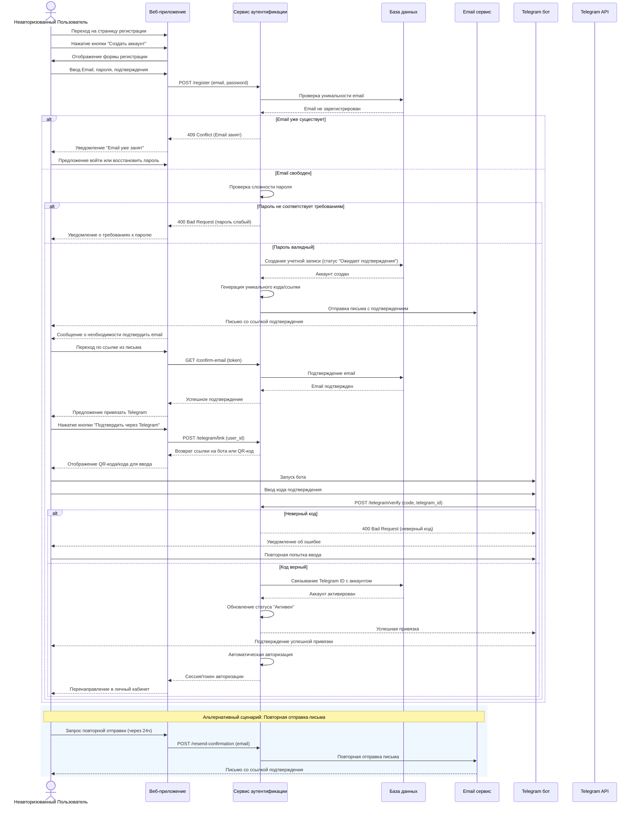

```mermaid
    sequenceDiagram
    actor User as Неавторизованный Пользователь
    participant WebApp as Веб-приложение
    participant AuthService as Сервис аутентификации
    participant Database as База данных
    participant EmailService as Email сервис
    participant TelegramBot as Telegram бот
    participant TelegramAPI as Telegram API

    User->>WebApp: Переход на страницу регистрации
    User->>WebApp: Нажатие кнопки "Создать аккаунт"
    WebApp->>User: Отображение формы регистрации
    
    User->>WebApp: Ввод Email, пароля, подтверждения
    WebApp->>AuthService: POST /register (email, password)
    
    AuthService->>Database: Проверка уникальности email
    Database-->>AuthService: Email не зарегистрирован
    
    alt Email уже существует
        AuthService-->>WebApp: 409 Conflict (Email занят)
        WebApp-->>User: Уведомление "Email уже занят"
        User->>WebApp: Предложение войти или восстановить пароль
    else Email свободен
        AuthService->>AuthService: Проверка сложности пароля
        
        alt Пароль не соответствует требованиям
            AuthService-->>WebApp: 400 Bad Request (пароль слабый)
            WebApp-->>User: Уведомление о требованиях к паролю
        else Пароль валидный
            AuthService->>Database: Создание учетной записи (статус "Ожидает подтверждения")
            Database-->>AuthService: Аккаунт создан
            AuthService->>AuthService: Генерация уникального кода/ссылки
            
            AuthService->>EmailService: Отправка письма с подтверждением
            EmailService-->>User: Письмо со ссылкой подтверждения
            WebApp-->>User: Сообщение о необходимости подтвердить email
            
            User->>WebApp: Переход по ссылке из письма
            WebApp->>AuthService: GET /confirm-email (token)
            AuthService->>Database: Подтверждение email
            Database-->>AuthService: Email подтвержден
            
            AuthService-->>WebApp: Успешное подтверждение
            WebApp-->>User: Предложение привязать Telegram
            
            User->>WebApp: Нажатие кнопки "Подтвердить через Telegram"
            WebApp->>AuthService: POST /telegram/link (user_id)
            AuthService-->>WebApp: Возврат ссылки на бота или QR-код
            WebApp-->>User: Отображение QR-кода/кода для ввода
            
            User->>TelegramBot: Запуск бота
            User->>TelegramBot: Ввод кода подтверждения
            TelegramBot->>AuthService: POST /telegram/verify (code, telegram_id)
            
            alt Неверный код
                AuthService-->>TelegramBot: 400 Bad Request (неверный код)
                TelegramBot-->>User: Уведомление об ошибке
                User->>TelegramBot: Повторная попытка ввода
            else Код верный
                AuthService->>Database: Связывание Telegram ID с аккаунтом
                Database-->>AuthService: Аккаунт активирован
                AuthService->>AuthService: Обновление статуса "Активен"
                AuthService-->>TelegramBot: Успешная привязка
                TelegramBot-->>User: Подтверждение успешной привязки
                
                AuthService->>AuthService: Автоматическая авторизация
                AuthService-->>WebApp: Сессия/токен авторизации
                WebApp-->>User: Перенаправление в личный кабинет
            end
        end
    end

    rect rgb(240, 248, 255)
        Note over User,EmailService: Альтернативный сценарий: Повторная отправка письма
        User->>WebApp: Запрос повторной отправки (через 24ч)
        WebApp->>AuthService: POST /resend-confirmation (email)
        AuthService->>EmailService: Повторная отправка письма
        EmailService-->>User: Письмо со ссылкой подтверждения
    end


```