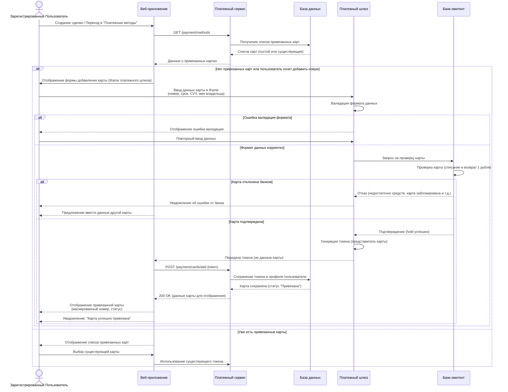

```mermaid
    sequenceDiagram
    actor User as Зарегистрированный Пользователь
    participant WebApp as Веб-приложение
    participant PaymentService as Платежный сервис
    participant Database as База данных
    participant PaymentGateway as Платежный шлюз
    participant Bank as Банк-эмитент

    User->>WebApp: Создание сделки / Переход в "Платежные методы"
    WebApp->>PaymentService: GET /payment/methods
    PaymentService->>Database: Получение списка привязанных карт
    Database-->>PaymentService: Список карт (пустой или существующие)
    PaymentService-->>WebApp: Данные о привязанных картах
    
    alt Нет привязанных карт или пользователь хочет добавить новую
        WebApp->>User: Отображение формы добавления карты (iframe платежного шлюза)
        
        User->>PaymentGateway: Ввод данных карты в iframe<br/>(номер, срок, CVV, имя владельца)
        
        PaymentGateway->>PaymentGateway: Валидация формата данных
        
        alt Ошибка валидации формата
            PaymentGateway-->>User: Отображение ошибки валидации
            User->>PaymentGateway: Повторный ввод данных
        else Формат данных корректен
            PaymentGateway->>Bank: Запрос на проверку карты
            Bank->>Bank: Проверка карты (списание и возврат 1 рубля)
            
            alt Карта отклонена банком
                Bank-->>PaymentGateway: Отказ (недостаточно средств, карта заблокирована и т.д.)
                PaymentGateway-->>User: Уведомление об ошибке от банка
                WebApp-->>User: Предложение ввести данные другой карты
            else Карта подтверждена
                Bank-->>PaymentGateway: Подтверждение (hold успешен)
                PaymentGateway->>PaymentGateway: Генерация токена (представитель карты)
                PaymentGateway-->>WebApp: Передача токена (не данные карты)
                
                WebApp->>PaymentService: POST /payment/cards/add (token)
                PaymentService->>Database: Сохранение токена в профиле пользователя
                Database-->>PaymentService: Карта сохранена (статус "Привязана")
                PaymentService-->>WebApp: 200 OK (данные карты для отображения)
                
                WebApp-->>User: Отображение привязанной карты<br/>(маскированный номер, статус)
                WebApp-->>User: Уведомление: "Карта успешно привязана"
            end
        end
    else Уже есть привязанные карты
        WebApp-->>User: Отображение списка привязанных карт
        User->>WebApp: Выбор существующей карты
        WebApp->>PaymentService: Использование существующего токена
    end

```