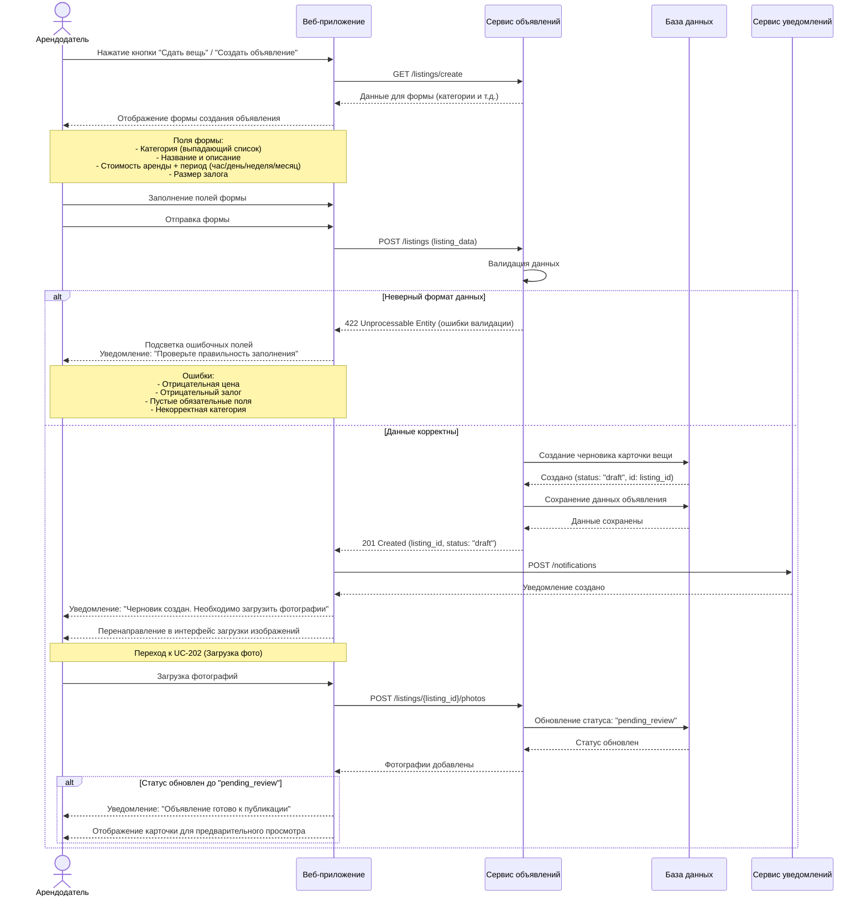

```mermaid
    sequenceDiagram
    actor User as Арендодатель
    participant WebApp as Веб-приложение
    participant ListingService as Сервис объявлений
    participant Database as База данных
    participant NotificationService as Сервис уведомлений

    User->>WebApp: Нажатие кнопки "Сдать вещь" / "Создать объявление"
    WebApp->>ListingService: GET /listings/create
    ListingService-->>WebApp: Данные для формы (категории и т.д.)
    WebApp-->>User: Отображение формы создания объявления
    
    Note over User,WebApp: Поля формы:<br/>- Категория (выпадающий список)<br/>- Название и описание<br/>- Стоимость аренды + период (час/день/неделя/месяц)<br/>- Размер залога
    
    User->>WebApp: Заполнение полей формы
    User->>WebApp: Отправка формы
    
    WebApp->>ListingService: POST /listings (listing_data)
    
    ListingService->>ListingService: Валидация данных
    
    alt Неверный формат данных
        ListingService-->>WebApp: 422 Unprocessable Entity (ошибки валидации)
        WebApp-->>User: Подсветка ошибочных полей<br/>Уведомление: "Проверьте правильность заполнения"
        Note over WebApp,User: Ошибки:<br/>- Отрицательная цена<br/>- Отрицательный залог<br/>- Пустые обязательные поля<br/>- Некорректная категория
    else Данные корректны
        ListingService->>Database: Создание черновика карточки вещи
        Database-->>ListingService: Создано (status: "draft", id: listing_id)
        
        ListingService->>Database: Сохранение данных объявления
        Database-->>ListingService: Данные сохранены
        
        ListingService-->>WebApp: 201 Created (listing_id, status: "draft")
        
        WebApp->>NotificationService: POST /notifications
        NotificationService-->>WebApp: Уведомление создано
        
        WebApp-->>User: Уведомление: "Черновик создан. Необходимо загрузить фотографии"
        WebApp-->>User: Перенаправление в интерфейс загрузки изображений
        
        Note over WebApp,User: Переход к UC-202 (Загрузка фото)
        
        User->>WebApp: Загрузка фотографий
        
        WebApp->>ListingService: POST /listings/{listing_id}/photos
        ListingService->>Database: Обновление статуса: "pending_review"
        Database-->>ListingService: Статус обновлен
        
        ListingService-->>WebApp: Фотографии добавлены
        
        alt Статус обновлен до "pending_review"
            WebApp-->>User: Уведомление: "Объявление готово к публикации"
            WebApp-->>User: Отображение карточки для предварительного просмотра
        end
    end

```