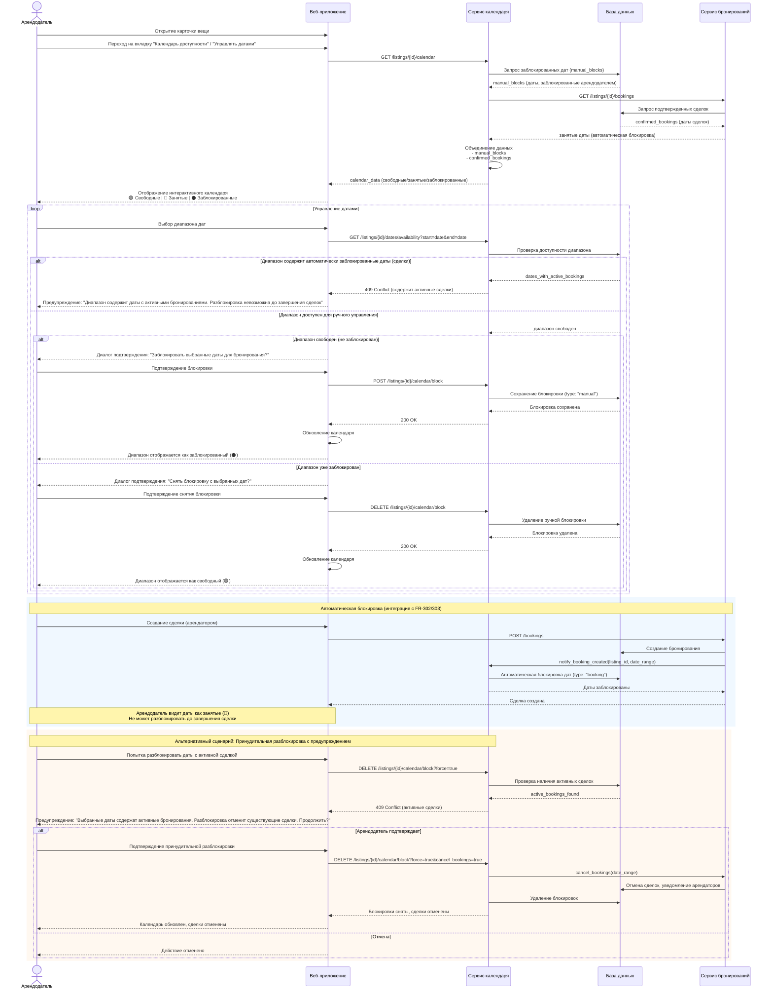

```mermaid
    sequenceDiagram
    actor User as Арендодатель
    participant WebApp as Веб-приложение
    participant CalendarService as Сервис календаря
    participant Database as База данных
    participant BookingService as Сервис бронирований

    User->>WebApp: Открытие карточки вещи
    User->>WebApp: Переход на вкладку "Календарь доступности" / "Управлять датами"
    
    WebApp->>CalendarService: GET /listings/{id}/calendar
    CalendarService->>Database: Запрос заблокированных дат (manual_blocks)
    Database-->>CalendarService: manual_blocks (даты, заблокированные арендодателем)
    
    CalendarService->>BookingService: GET /listings/{id}/bookings
    BookingService->>Database: Запрос подтвержденных сделок
    Database-->>BookingService: confirmed_bookings (даты сделок)
    BookingService-->>CalendarService: занятые даты (автоматическая блокировка)
    
    CalendarService->>CalendarService: Объединение данных<br/>- manual_blocks<br/>- confirmed_bookings
    CalendarService-->>WebApp: calendar_data (свободные/занятые/заблокированные)
    
    WebApp-->>User: Отображение интерактивного календаря<br/>🟢 Свободные | 🔴 Занятые | ⚫ Заблокированные

    loop Управление датами
        User->>WebApp: Выбор диапазона дат
        
        WebApp->>CalendarService: GET /listings/{id}/dates/availability?start=date&end=date
        CalendarService->>Database: Проверка доступности диапазона
        
        alt Диапазон содержит автоматически заблокированные даты (сделки)
            Database-->>CalendarService: dates_with_active_bookings
            CalendarService-->>WebApp: 409 Conflict (содержит активные сделки)
            WebApp-->>User: Предупреждение: "Диапазон содержит даты с активными бронированиями. Разблокировка невозможна до завершения сделок"
        else Диапазон доступен для ручного управления
            Database-->>CalendarService: диапазон свободен
            
            alt Диапазон свободен (не заблокирован)
                WebApp-->>User: Диалог подтверждения: "Заблокировать выбранные даты для бронирования?"
                User->>WebApp: Подтверждение блокировки
                
                WebApp->>CalendarService: POST /listings/{id}/calendar/block
                CalendarService->>Database: Сохранение блокировки (type: "manual")
                Database-->>CalendarService: Блокировка сохранена
                CalendarService-->>WebApp: 200 OK
                WebApp->>WebApp: Обновление календаря
                WebApp-->>User: Диапазон отображается как заблокированный (⚫)
                
            else Диапазон уже заблокирован
                WebApp-->>User: Диалог подтверждения: "Снять блокировку с выбранных дат?"
                User->>WebApp: Подтверждение снятия блокировки
                
                WebApp->>CalendarService: DELETE /listings/{id}/calendar/block
                CalendarService->>Database: Удаление ручной блокировки
                Database-->>CalendarService: Блокировка удалена
                CalendarService-->>WebApp: 200 OK
                WebApp->>WebApp: Обновление календаря
                WebApp-->>User: Диапазон отображается как свободный (🟢)
            end
        end
    end

    rect rgb(240, 248, 255)
        Note over User,BookingService: Автоматическая блокировка (интеграция с FR-302/303)
        User->>WebApp: Создание сделки (арендатором)
        WebApp->>BookingService: POST /bookings
        BookingService->>Database: Создание бронирования
        BookingService->>CalendarService: notify_booking_created(listing_id, date_range)
        CalendarService->>Database: Автоматическая блокировка дат (type: "booking")
        CalendarService-->>BookingService: Даты заблокированы
        BookingService-->>WebApp: Сделка создана
        
        Note over WebApp,User: Арендодатель видит даты как занятые (🔴)<br/>Не может разблокировать до завершения сделки
    end

    rect rgb(255, 248, 240)
        Note over User,CalendarService: Альтернативный сценарий: Принудительная разблокировка с предупреждением
        User->>WebApp: Попытка разблокировать даты с активной сделкой
        WebApp->>CalendarService: DELETE /listings/{id}/calendar/block?force=true
        CalendarService->>Database: Проверка наличия активных сделок
        Database-->>CalendarService: active_bookings_found
        
        CalendarService-->>WebApp: 409 Conflict (активные сделки)
        WebApp-->>User: Предупреждение: "Выбранные даты содержат активные бронирования. Разблокировка отменит существующие сделки. Продолжить?"
        
        alt Арендодатель подтверждает
            User->>WebApp: Подтверждение принудительной разблокировки
            WebApp->>CalendarService: DELETE /listings/{id}/calendar/block?force=true&cancel_bookings=true
            CalendarService->>BookingService: cancel_bookings(date_range)
            BookingService->>Database: Отмена сделок, уведомление арендаторов
            CalendarService->>Database: Удаление блокировок
            CalendarService-->>WebApp: Блокировки сняты, сделки отменены
            WebApp-->>User: Календарь обновлен, сделки отменены
        else Отмена
            WebApp-->>User: Действие отменено
        end
    end

```