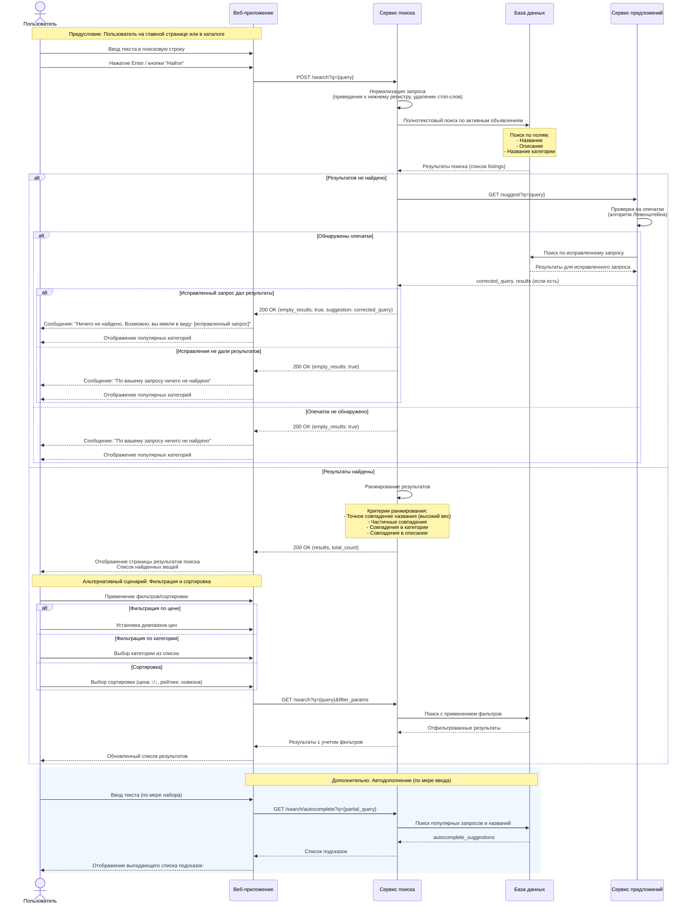

```mermaid
    sequenceDiagram
    actor User as Пользователь
    participant WebApp as Веб-приложение
    participant SearchService as Сервис поиска
    participant Database as База данных
    participant SuggestionService as Сервис предложений

    Note over User,WebApp: Предусловие: Пользователь на главной странице или в каталоге

    User->>WebApp: Ввод текста в поисковую строку
    User->>WebApp: Нажатие Enter / кнопки "Найти"
    
    WebApp->>SearchService: POST /search?q={query}
    SearchService->>SearchService: Нормализация запроса<br/>(приведение к нижнему регистру, удаление стоп-слов)
    
    SearchService->>Database: Полнотекстовый поиск по активным объявлениям
    
    Note over Database: Поиск по полям:<br/>- Название<br/>- Описание<br/>- Название категории
    
    Database-->>SearchService: Результаты поиска (список listings)
    
    alt Результатов не найдено
        SearchService->>SuggestionService: GET /suggest?q={query}
        
        SuggestionService->>SuggestionService: Проверка на опечатки<br/>(алгоритм Левенштейна)
        
        alt Обнаружены опечатки
            SuggestionService->>Database: Поиск по исправленному запросу
            Database-->>SuggestionService: Результаты для исправленного запроса
            SuggestionService-->>SearchService: corrected_query, results (если есть)
            
            alt Исправленный запрос дал результаты
                SearchService-->>WebApp: 200 OK (empty_results: true, suggestion: corrected_query)
                WebApp-->>User: Сообщение: "Ничего не найдено. Возможно, вы имели в виду: [исправленный запрос]"
                WebApp-->>User: Отображение популярных категорий
            else Исправления не дали результатов
                SearchService-->>WebApp: 200 OK (empty_results: true)
                WebApp-->>User: Сообщение: "По вашему запросу ничего не найдено"
                WebApp-->>User: Отображение популярных категорий
            end
        else Опечаток не обнаружено
            SearchService-->>WebApp: 200 OK (empty_results: true)
            WebApp-->>User: Сообщение: "По вашему запросу ничего не найдено"
            WebApp-->>User: Отображение популярных категорий
        end
    else Результаты найдены
        SearchService->>SearchService: Ранжирование результатов
        Note over SearchService: Критерии ранжирования:<br/>- Точное совпадение названия (высокий вес)<br/>- Частичные совпадения<br/>- Совпадения в категории<br/>- Совпадения в описании
        
        SearchService-->>WebApp: 200 OK (results, total_count)
        
        WebApp-->>User: Отображение страницы результатов поиска<br/>Список найденных вещей
        
        Note over User,WebApp: Альтернативный сценарий: Фильтрация и сортировка
        
        User->>WebApp: Применение фильтров/сортировки
        
        alt Фильтрация по цене
            User->>WebApp: Установка диапазона цен
        else Фильтрация по категории
            User->>WebApp: Выбор категории из списка
        else Сортировка
            User->>WebApp: Выбор сортировки (цена ↑/↓, рейтинг, новизна)
        end
        
        WebApp->>SearchService: GET /search?q={query}&filter_params
        SearchService->>Database: Поиск с применением фильтров
        Database-->>SearchService: Отфильтрованные результаты
        SearchService-->>WebApp: Результаты с учетом фильтров
        WebApp-->>User: Обновленный список результатов
    end
    
    rect rgb(240, 248, 255)
        Note over WebApp,Database: Дополнительно: Автодополнение (по мере ввода)
        User->>WebApp: Ввод текста (по мере набора)
        WebApp->>SearchService: GET /search/autocomplete?q={partial_query}
        SearchService->>Database: Поиск популярных запросов и названий
        Database-->>SearchService: autocomplete_suggestions
        SearchService-->>WebApp: Список подсказок
        WebApp-->>User: Отображение выпадающего списка подсказок
    end

```