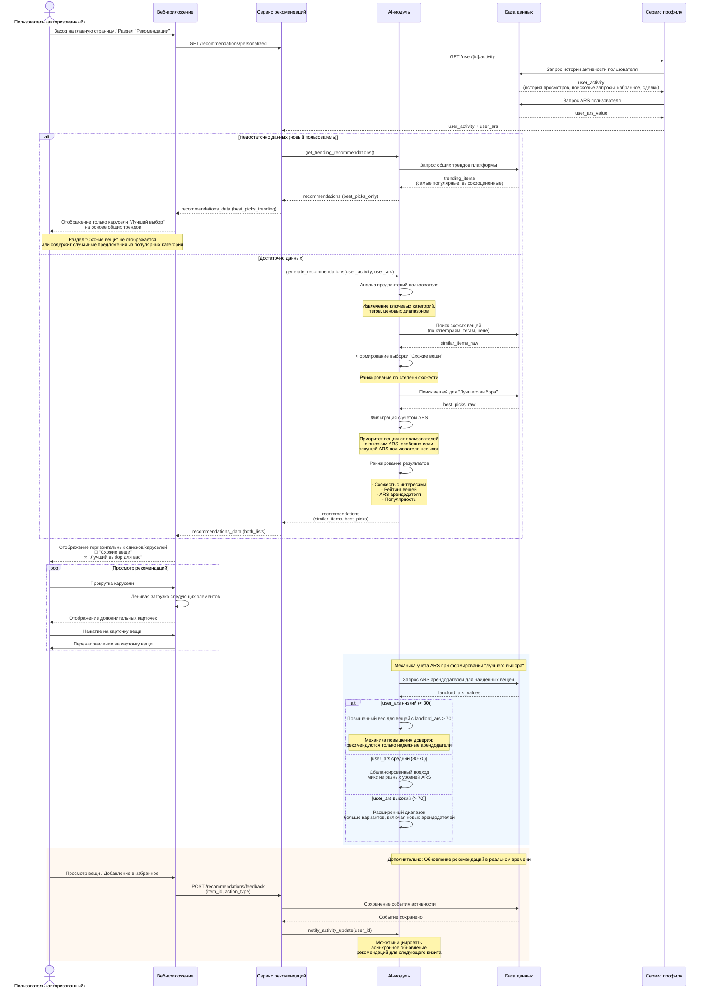

```mermaid
    sequenceDiagram
    actor User as Пользователь (авторизованный)
    participant WebApp as Веб-приложение
    participant RecService as Сервис рекомендаций
    participant AIModule as AI-модуль
    participant Database as База данных
    participant ProfileService as Сервис профиля

    User->>WebApp: Заход на главную страницу / Раздел "Рекомендации"
    
    WebApp->>RecService: GET /recommendations/personalized
    RecService->>ProfileService: GET /user/{id}/activity
    
    ProfileService->>Database: Запрос истории активности пользователя
    Database-->>ProfileService: user_activity<br/>(история просмотров, поисковые запросы, избранное, сделки)
    
    ProfileService->>Database: Запрос ARS пользователя
    Database-->>ProfileService: user_ars_value
    
    ProfileService-->>RecService: user_activity + user_ars
    
    alt Недостаточно данных (новый пользователь)
        RecService->>AIModule: get_trending_recommendations()
        AIModule->>Database: Запрос общих трендов платформы
        Database-->>AIModule: trending_items<br/>(самые популярные, высокооцененные)
        AIModule-->>RecService: recommendations (best_picks_only)
        RecService-->>WebApp: recommendations_data (best_picks_trending)
        WebApp-->>User: Отображение только карусели "Лучший выбор"<br/>на основе общих трендов
        Note over WebApp,User: Раздел "Схожие вещи" не отображается<br/>или содержит случайные предложения из популярных категорий
    else Достаточно данных
        RecService->>AIModule: generate_recommendations(user_activity, user_ars)
        
        AIModule->>AIModule: Анализ предпочтений пользователя
        Note over AIModule: Извлечение ключевых категорий,<br/>тегов, ценовых диапазонов
        
        AIModule->>Database: Поиск схожих вещей<br/>(по категориям, тегам, цене)
        Database-->>AIModule: similar_items_raw
        
        AIModule->>AIModule: Формирование выборки "Схожие вещи"
        Note over AIModule: Ранжирование по степени схожести
        
        AIModule->>Database: Поиск вещей для "Лучшего выбора"
        Database-->>AIModule: best_picks_raw
        
        AIModule->>AIModule: Фильтрация с учетом ARS
        Note over AIModule: Приоритет вещам от пользователей<br/>с высоким ARS, особенно если<br/>текущий ARS пользователя невысок
        
        AIModule->>AIModule: Ранжирование результатов
        Note over AIModule: - Схожесть с интересами<br/>- Рейтинг вещей<br/>- ARS арендодателя<br/>- Популярность
        
        AIModule-->>RecService: recommendations<br/>(similar_items, best_picks)
        
        RecService-->>WebApp: recommendations_data (both_lists)
    end
    
    WebApp-->>User: Отображение горизонтальных списков/каруселей<br/>📌 "Схожие вещи"<br/>⭐ "Лучший выбор для вас"
    
    loop Просмотр рекомендаций
        User->>WebApp: Прокрутка карусели
        WebApp->>WebApp: Ленивая загрузка следующих элементов
        WebApp-->>User: Отображение дополнительных карточек
        
        User->>WebApp: Нажатие на карточку вещи
        WebApp->>User: Перенаправление на карточку вещи
    end
    
    rect rgb(240, 248, 255)
        Note over AIModule,Database: Механика учета ARS при формировании "Лучшего выбора"
        AIModule->>Database: Запрос ARS арендодателей для найденных вещей
        Database-->>AIModule: landlord_ars_values
        
        alt user_ars низкий (< 30)
            AIModule->>AIModule: Повышенный вес для вещей с landlord_ars > 70
            Note over AIModule: Механика повышения доверия:<br/>рекомендуются только надежные арендодатели
        else user_ars средний (30-70)
            AIModule->>AIModule: Сбалансированный подход<br/>микс из разных уровней ARS
        else user_ars высокий (> 70)
            AIModule->>AIModule: Расширенный диапазон<br/>больше вариантов, включая новых арендодателей
        end
    end
    
    rect rgb(255, 248, 240)
        Note over AIModule,Database: Дополнительно: Обновление рекомендаций в реальном времени
        User->>WebApp: Просмотр вещи / Добавление в избранное
        WebApp->>RecService: POST /recommendations/feedback<br/>(item_id, action_type)
        RecService->>Database: Сохранение события активности
        Database-->>RecService: Событие сохранено
        RecService->>AIModule: notify_activity_update(user_id)
        Note over AIModule: Может инициировать<br/>асинхронное обновление<br/>рекомендаций для следующего визита
    end

```