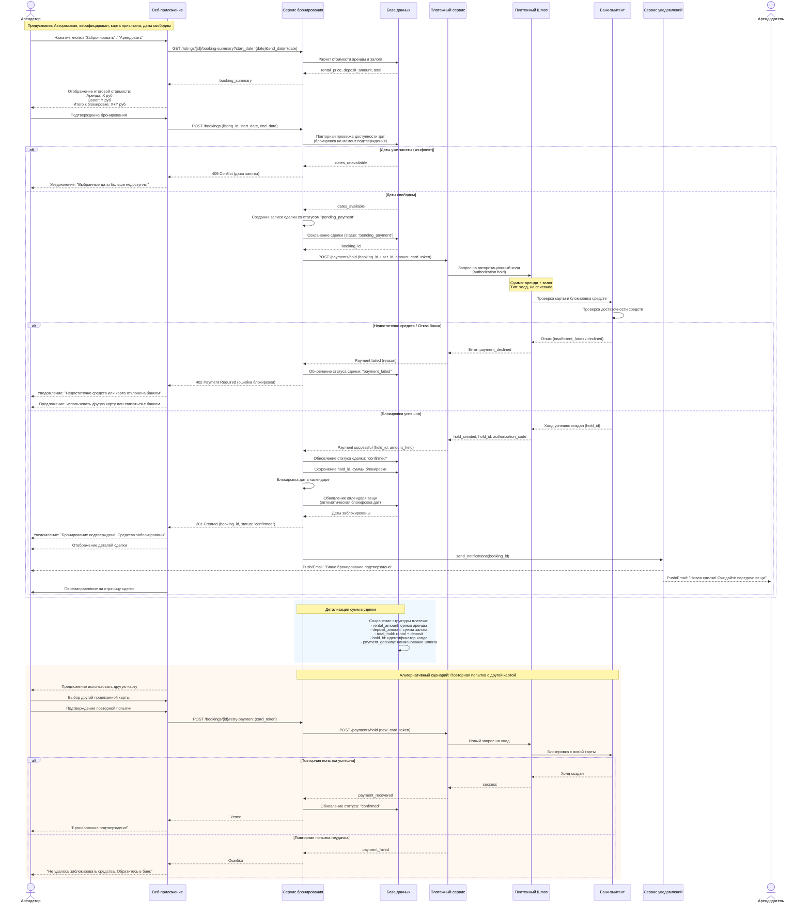

```mermaid
    sequenceDiagram
    actor Renter as Арендатор
    participant WebApp as Веб-приложение
    participant BookingService as Сервис бронирования
    participant Database as База данных
    participant PaymentService as Платежный сервис
    participant PaymentGateway as Платежный Шлюз
    participant Bank as Банк-эмитент
    participant NotifyService as Сервис уведомлений
    actor Landlord as Арендодатель

    Note over Renter,WebApp: Предусловия: Авторизован, верифицирован, карта привязана, даты свободны

    Renter->>WebApp: Нажатие кнопки "Забронировать" / "Арендовать"
    WebApp->>BookingService: GET /listings/{id}/booking-summary?start_date={date}&end_date={date}
    BookingService->>Database: Расчет стоимости аренды и залога
    Database-->>BookingService: rental_price, deposit_amount, total
    BookingService-->>WebApp: booking_summary
    WebApp-->>Renter: Отображение итоговой стоимости:<br/>Аренда: X руб<br/>Залог: Y руб<br/>Итого к блокировке: X+Y руб
    
    Renter->>WebApp: Подтверждение бронирования
    WebApp->>BookingService: POST /bookings (listing_id, start_date, end_date)
    
    BookingService->>Database: Повторная проверка доступности дат<br/>(блокировка на момент подтверждения)
    
    alt Даты уже заняты (конфликт)
        Database-->>BookingService: dates_unavailable
        BookingService-->>WebApp: 409 Conflict (даты заняты)
        WebApp-->>Renter: Уведомление: "Выбранные даты больше недоступны"
    else Даты свободны
        Database-->>BookingService: dates_available
        
        BookingService->>BookingService: Создание записи сделки со статусом "pending_payment"
        BookingService->>Database: Сохранение сделки (status: "pending_payment")
        Database-->>BookingService: booking_id
        
        BookingService->>PaymentService: POST /payments/hold (booking_id, user_id, amount, card_token)
        
        PaymentService->>PaymentGateway: Запрос на авторизационный холд<br/>(authorization hold)
        Note over PaymentGateway: Сумма: аренда + залог<br/>Тип: холд, не списание
        
        PaymentGateway->>Bank: Проверка карты и блокировка средств
        Bank->>Bank: Проверка достаточности средств
        
        alt Недостаточно средств / Отказ банка
            Bank-->>PaymentGateway: Отказ (insufficient_funds / declined)
            PaymentGateway-->>PaymentService: Error: payment_declined
            PaymentService-->>BookingService: Payment failed (reason)
            BookingService->>Database: Обновление статуса сделки: "payment_failed"
            BookingService-->>WebApp: 402 Payment Required (ошибка блокировки)
            WebApp-->>Renter: Уведомление: "Недостаточно средств или карта отклонена банком"
            WebApp-->>Renter: Предложение: использовать другую карту или связаться с банком
        else Блокировка успешна
            Bank-->>PaymentGateway: Холд успешно создан (hold_id)
            PaymentGateway-->>PaymentService: hold_created, hold_id, authorization_code
            PaymentService-->>BookingService: Payment successful (hold_id, amount_held)
            
            BookingService->>Database: Обновление статуса сделки: "confirmed"
            BookingService->>Database: Сохранение hold_id, суммы блокировки
            
            BookingService->>BookingService: Блокировка дат в календаре
            BookingService->>Database: Обновление календаря вещи<br/>(автоматическая блокировка дат)
            Database-->>BookingService: Даты заблокированы
            
            BookingService-->>WebApp: 201 Created (booking_id, status: "confirmed")
            WebApp-->>Renter: Уведомление: "Бронирование подтверждено! Средства заблокированы"
            WebApp-->>Renter: Отображение деталей сделки
            
            BookingService->>NotifyService: send_notifications(booking_id)
            
            NotifyService-->>Renter: Push/Email: "Ваше бронирование подтверждено"
            NotifyService-->>Landlord: Push/Email: "Новая сделка! Ожидайте передачи вещи"
            
            WebApp->>Renter: Перенаправление на страницу сделки
        end
    end
    
    rect rgb(240, 248, 255)
        Note over BookingService,Database: Детализация сумм в сделке
        
        Database->>Database: Сохранение структуры платежа:<br/>- rental_amount: сумма аренды<br/>- deposit_amount: сумма залога<br/>- total_hold: rental + deposit<br/>- hold_id: идентификатор холда<br/>- payment_gateway: наименование шлюза
    end
    
    rect rgb(255, 248, 240)
        Note over BookingService,Bank: Альтернативный сценарий: Повторная попытка с другой картой
        
        WebApp-->>Renter: Предложение использовать другую карту
        Renter->>WebApp: Выбор другой привязанной карты
        Renter->>WebApp: Подтверждение повторной попытки
        WebApp->>BookingService: POST /bookings/{id}/retry-payment (card_token)
        BookingService->>PaymentService: POST /payments/hold (new_card_token)
        
        PaymentService->>PaymentGateway: Новый запрос на холд
        PaymentGateway->>Bank: Блокировка с новой карты
        
        alt Повторная попытка успешна
            Bank-->>PaymentGateway: Холд создан
            PaymentGateway-->>PaymentService: success
            PaymentService-->>BookingService: payment_recovered
            BookingService->>Database: Обновление статуса: "confirmed"
            BookingService-->>WebApp: Успех
            WebApp-->>Renter: "Бронирование подтверждено!"
        else Повторная попытка неудачна
            PaymentService-->>BookingService: payment_failed
            BookingService-->>WebApp: Ошибка
            WebApp-->>Renter: "Не удалось заблокировать средства. Обратитесь в банк"
        end
    end

```