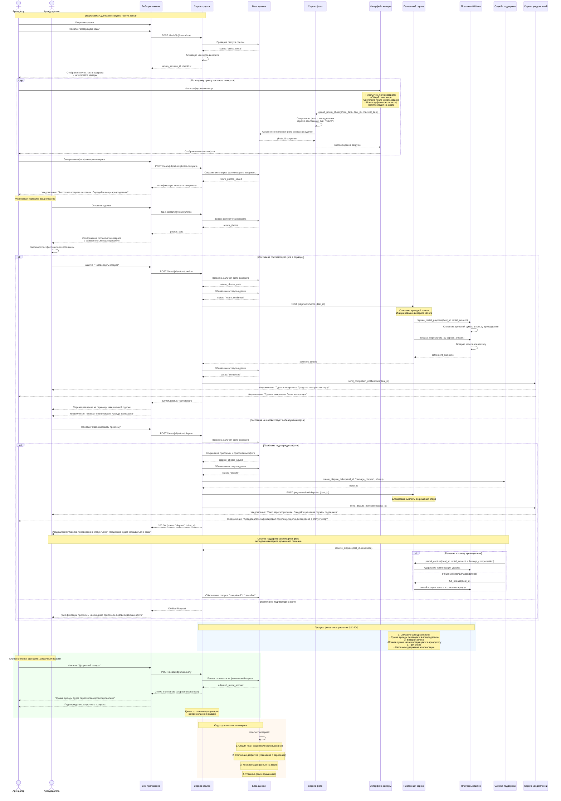

```mermaid
    sequenceDiagram
    actor Renter as Арендатор
    actor Landlord as Арендодатель
    participant WebApp as Веб-приложение
    participant DealService as Сервис сделок
    participant Database as База данных
    participant PhotoService as Сервис фото
    participant CameraInterface as Интерфейс камеры
    participant PaymentService as Платежный сервис
    participant PaymentGateway as Платежный Шлюз
    participant SupportService as Служба поддержки
    participant NotifyService as Сервис уведомлений

    Note over Renter,DealService: Предусловие: Сделка со статусом "active_rental"

    Renter->>WebApp: Открытие сделки
    Renter->>WebApp: Нажатие "Возвращаю вещь"
    
    WebApp->>DealService: POST /deals/{id}/return/start
    DealService->>Database: Проверка статуса сделки
    Database-->>DealService: status: "active_rental"
    
    DealService->>DealService: Активация чек-листа возврата
    DealService-->>WebApp: return_session_id, checklist
    
    WebApp-->>Renter: Отображение чек-листа возврата<br/>и интерфейса камеры
    
    loop По каждому пункту чек-листа возврата
        Renter->>CameraInterface: Фотографирование вещи
        Note over CameraInterface: Пункты чек-листа возврата:<br/>- Общий план вещи<br/>- Состояние после использования<br/>- Новые дефекты (если есть)<br/>- Комплектация на месте
        
        CameraInterface->>PhotoService: upload_return_photo(photo_data, deal_id, checklist_item)
        PhotoService->>PhotoService: Сохранение фото с метаданными<br/>(время, геолокация, тип: "return")
        PhotoService->>Database: Сохранение привязки фото возврата к сделке
        Database-->>PhotoService: photo_id сохранен
        PhotoService-->>CameraInterface: подтверждение загрузки
        CameraInterface-->>Renter: Отображение превью фото
    end
    
    Renter->>WebApp: Завершение фотофиксации возврата
    WebApp->>DealService: POST /deals/{id}/return/photos-complete
    DealService->>Database: Сохранение статуса: фото возврата загружены
    Database-->>DealService: return_photos_saved
    
    DealService-->>WebApp: Фотофиксация возврата завершена
    WebApp-->>Renter: Уведомление: "Фотоотчет возврата сохранен. Передайте вещь арендодателю"
    
    Note over Renter,Landlord: Физическая передача вещи обратно
    
    Landlord->>WebApp: Открытие сделки
    WebApp->>DealService: GET /deals/{id}/return/photos
    DealService->>Database: Запрос фотоотчета возврата
    Database-->>DealService: return_photos
    DealService-->>WebApp: photos_data
    WebApp-->>Landlord: Отображение фотоотчета возврата<br/>с возможностью подтверждения
    
    Landlord->>Landlord: Сверка фото с фактическим состоянием
    
    alt Состояние соответствует (все в порядке)
        Landlord->>WebApp: Нажатие "Подтвердить возврат"
        
        WebApp->>DealService: POST /deals/{id}/return/confirm
        DealService->>Database: Проверка наличия фото возврата
        Database-->>DealService: return_photos_exist
        
        DealService->>Database: Обновление статуса сделки
        Database-->>DealService: status: "return_confirmed"
        
        DealService->>PaymentService: POST /payments/settle (deal_id)
        Note over PaymentService: Списание арендной платы<br/>Инициирование возврата залога
        
        PaymentService->>PaymentGateway: capture_rental_payment(hold_id, rental_amount)
        PaymentGateway->>PaymentGateway: Списание арендной суммы в пользу арендодателя
        
        PaymentService->>PaymentGateway: release_deposit(hold_id, deposit_amount)
        PaymentGateway->>PaymentGateway: Возврат залога арендатору
        
        PaymentGateway-->>PaymentService: settlement_complete
        PaymentService-->>DealService: payment_settled
        
        DealService->>Database: Обновление статуса сделки
        Database-->>DealService: status: "completed"
        
        DealService->>NotifyService: send_completion_notifications(deal_id)
        NotifyService-->>Landlord: Уведомление: "Сделка завершена. Средства поступят на карту"
        NotifyService-->>Renter: Уведомление: "Сделка завершена. Залог возвращен"
        
        DealService-->>WebApp: 200 OK (status: "completed")
        WebApp-->>Landlord: Перенаправление на страницу завершенной сделки
        WebApp-->>Landlord: Уведомление: "Возврат подтвержден. Аренда завершена"
        
    else Состояние не соответствует / обнаружена порча
        Landlord->>WebApp: Нажатие "Зафиксировать проблему"
        
        WebApp->>DealService: POST /deals/{id}/return/dispute
        DealService->>Database: Проверка наличия фото возврата
        
        alt Проблема подтверждена фото
            DealService->>Database: Сохранение проблемы и приложенных фото
            Database-->>DealService: dispute_photos_saved
            
            DealService->>Database: Обновление статуса сделки
            Database-->>DealService: status: "dispute"
            
            DealService->>SupportService: create_dispute_ticket(deal_id, "damage_dispute", photos)
            SupportService-->>DealService: ticket_id
            
            DealService->>PaymentService: POST /payments/hold-disputed (deal_id)
            Note over PaymentService: Блокировка выплаты до решения спора
            
            DealService->>NotifyService: send_dispute_notifications(deal_id)
            NotifyService-->>Landlord: Уведомление: "Спор зарегистрирован. Ожидайте решения службы поддержки"
            NotifyService-->>Renter: Уведомление: "Арендодатель зафиксировал проблему. Сделка переведена в статус 'Спор'"
            
            DealService-->>WebApp: 200 OK (status: "dispute", ticket_id)
            WebApp-->>Landlord: Уведомление: "Сделка переведена в статус 'Спор'. Поддержка будет связываться с вами"
            
            Note over SupportService,Landlord: Служба поддержки анализирует фото<br/>передачи и возврата, принимает решение
            SupportService->>DealService: resolve_dispute(deal_id, resolution)
            
            alt Решение в пользу арендодателя
                SupportService->>PaymentService: partial_capture(deal_id, rental_amount + damage_compensation)
                PaymentService->>PaymentGateway: удержание компенсации ущерба
            else Решение в пользу арендатора
                SupportService->>PaymentService: full_release(deal_id)
                PaymentService->>PaymentGateway: полный возврат залога и списание аренды
            end
            
            DealService->>Database: Обновление статуса: "completed" / "cancelled"
        else Проблема не подтверждена фото
            DealService-->>WebApp: 400 Bad Request
            WebApp-->>Landlord: "Для фиксации проблемы необходимо приложить подтверждающие фото"
        end
    end
    
    rect rgb(240, 248, 255)
        Note over DealService,PaymentGateway: Процесс финальных расчетов (UC-404)
        
        Note over PaymentService: 1. Списание арендной платы<br/>   - Сумма аренды переводится арендодателю<br/>2. Возврат залога<br/>   - Полная сумма залога возвращается арендатору<br/>3. При споре<br/>   - Частичное удержание компенсации
    end
    
    rect rgb(240, 255, 240)
        Note over Renter,Landlord: Альтернативный сценарий: Досрочный возврат
        
        Renter->>WebApp: Нажатие "Досрочный возврат"
        WebApp->>DealService: POST /deals/{id}/return/early
        
        DealService->>Database: Расчет стоимости за фактический период
        Database-->>DealService: adjusted_rental_amount
        
        DealService-->>WebApp: Сумма к списанию (скорректированная)
        WebApp-->>Renter: "Сумма аренды будет пересчитана пропорционально"
        WebApp-->>Renter: Подтверждение досрочного возврата
        
        Note over DealService: Далее по основному сценарию<br/>с пересчитанной суммой
    end
    
    rect rgb(255, 248, 240)
        Note over DealService,Database: Структура чек-листа возврата
        
        Database->>Database: Чек-лист возврата:<br/>
        Note over Database: 1. Общий план вещи после использования<br/>
        Note over Database: 2. Состояние дефектов (сравнение с передачей)<br/>
        Note over Database: 3. Комплектация (все ли на месте)<br/>
        Note over Database: 4. Упаковка (если применимо)
    end

```