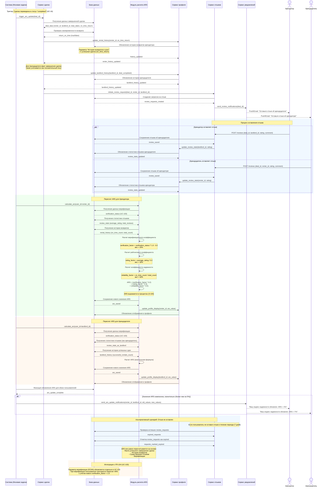

```mermaid
    sequenceDiagram
    participant System as Система (Фоновая задача)
    participant DealService as Сервис сделок
    participant Database as База данных
    participant ARSEngine as Модуль расчета ARS
    participant ProfileService as Сервис профиля
    participant ReviewService as Сервис отзывов
    participant NotifyService as Сервис уведомлений
    actor Renter as Арендатор
    actor Landlord as Арендодатель

    Note over System,DealService: Триггер: Сделка переведена в статус "completed" (UC-16)

    System->>DealService: trigger_ars_update(deal_id)
    DealService->>Database: Получение данных завершенной сделки
    Database-->>DealService: deal_data (renter_id, landlord_id, deal_dates, on_time_return)
    
    DealService->>Database: Проверка своевременности возврата
    Database-->>DealService: return_on_time (true/false)
    
    DealService->>ProfileService: update_rental_history(renter_id, on_time_return)
    ProfileService->>Database: Обновление истории возвратов арендатора
    Note over Database: Параметр "История возвратов в срок":<br/>+1 успешная сделка (on_time_return)
    Database-->>ProfileService: history_updated
    ProfileService-->>DealService: renter_history_updated
    
    Note over DealService: Для Арендодателя факт завершения сделки<br/>также учитывается как положительный опыт
    
    DealService->>ProfileService: update_landlord_history(landlord_id, deal_completed)
    ProfileService->>Database: Обновление истории арендодателя
    Database-->>ProfileService: landlord_history_updated
    ProfileService-->>DealService: landlord_history_updated
    
    DealService->>ReviewService: initiate_review_request(deal_id, renter_id, landlord_id)
    ReviewService->>Database: Создание запросов на отзыв
    Database-->>ReviewService: review_requests_created
    
    ReviewService->>NotifyService: send_review_notifications(deal_id)
    
    NotifyService-->>Renter: Push/Email: "Оставьте отзыв об арендодателе"
    NotifyService-->>Landlord: Push/Email: "Оставьте отзыв об арендаторе"
    
    rect rgb(240, 248, 255)
        Note over Renter,ReviewService: Процесс оставления отзыва
        
        par Арендатор оставляет отзыв
            Renter->>ReviewService: POST /reviews (deal_id, landlord_id, rating, comment)
            ReviewService->>Database: Сохранение отзыва об арендодателе
            Database-->>ReviewService: review_saved
            ReviewService->>ProfileService: update_review_stats(landlord_id, rating)
            ProfileService->>Database: Обновление статистики отзывов арендодателя
            Database-->>ProfileService: review_stats_updated
        and Арендодатель оставляет отзыв
            Landlord->>ReviewService: POST /reviews (deal_id, renter_id, rating, comment)
            ReviewService->>Database: Сохранение отзыва об арендаторе
            Database-->>ReviewService: review_saved
            ReviewService->>ProfileService: update_review_stats(renter_id, rating)
            ProfileService->>Database: Обновление статистики отзывов арендатора
            Database-->>ProfileService: review_stats_updated
        end
    end
    
    rect rgb(240, 255, 240)
        Note over ARSEngine,Database: Пересчет ARS для Арендатора
        
        System->>ARSEngine: calculate_ars(user_id=renter_id)
        
        ARSEngine->>Database: Получение данных верификации
        Database-->>ARSEngine: verification_status (UC-103)
        
        ARSEngine->>Database: Получение статистики отзывов
        Database-->>ARSEngine: review_stats (average_rating, total_reviews)
        
        ARSEngine->>Database: Получение истории возвратов
        Database-->>ARSEngine: rental_history (on_time_count, total_count)
        
        ARSEngine->>ARSEngine: Расчет верификационного коэффициента
        Note over ARSEngine: verification_factor = verification_status ? 1.0 : 0.0<br/>вес = 20%
        
        ARSEngine->>ARSEngine: Расчет рейтингового коэффициента
        Note over ARSEngine: rating_factor = average_rating / 5.0<br/>вес = 30%
        
        ARSEngine->>ARSEngine: Расчет коэффициента надежности
        Note over ARSEngine: reliability_factor = on_time_count / total_count<br/>вес = 50%
        
        ARSEngine->>ARSEngine: ARS = (verification_factor * 0.2)<br/>+ (rating_factor * 0.3)<br/>+ (reliability_factor * 0.5)
        Note over ARSEngine: ARS выражается в процентах (0-100)
        
        ARSEngine->>Database: Сохранение нового значения ARS
        Database-->>ARSEngine: ars_saved
        
        ARSEngine->>ProfileService: update_profile_display(renter_id, ars_value)
        ProfileService->>Database: Обновление отображения в профиле
    end
    
    rect rgb(255, 248, 240)
        Note over ARSEngine,Database: Пересчет ARS для Арендодателя
        
        System->>ARSEngine: calculate_ars(user_id=landlord_id)
        
        ARSEngine->>Database: Получение данных верификации
        Database-->>ARSEngine: verification_status (UC-103)
        
        ARSEngine->>Database: Получение статистики отзывов (как арендодатель)
        Database-->>ARSEngine: review_stats_as_landlord
        
        ARSEngine->>Database: Получение истории успешных сдач
        Database-->>ARSEngine: landlord_history (successful_rentals_count)
        
        ARSEngine->>ARSEngine: Расчет ARS (аналогичная формула)
        
        ARSEngine->>Database: Сохранение нового значения ARS
        Database-->>ARSEngine: ars_saved
        
        ARSEngine->>ProfileService: update_profile_display(landlord_id, ars_value)
        ProfileService->>Database: Обновление отображения в профиле
    end
    
    System->>Database: Фиксация обновления ARS для обоих пользователей
    Database-->>System: ars_update_complete
    
    alt Значения ARS изменились значительно (более чем на 5%)
        System->>NotifyService: send_ars_update_notifications(renter_id, landlord_id, old_values, new_values)
        NotifyService-->>Renter: "Ваш индекс надежности обновлен: ARS = X%"
        NotifyService-->>Landlord: "Ваш индекс надежности обновлен: ARS = Y%"
    end
    
    rect rgb(240, 248, 255)
        Note over ReviewService,Database: Альтернативный сценарий: Отзыв не оставлен
        
        Note over ReviewService: Если пользователь не оставил отзыв в течение периода (7 дней)
        ReviewService->>Database: Проверка истекших review_requests
        Database-->>ReviewService: expired_requests
        
        ReviewService->>Database: Отметка review_requests как expired
        Database-->>ReviewService: requests_marked_expired
        
        Note over ARSEngine: ARS все равно пересчитывается на основе:<br/>- Факта успешного завершения сделки<br/>- Истории возвратов<br/>- Существующих отзывов<br/>- Верификации
    end
    
    rect rgb(255, 248, 240)
        Note over ARSEngine,Database: Интеграция с FR-104 (UC-103)
        
        Note over Database: Параметр верификации (ЕСИА) обновляется отдельно в UC-103<br/>При верификации пользователя триггерится пересчет ARS<br/>с учетом нового verification_factor = 1.0
    end

```