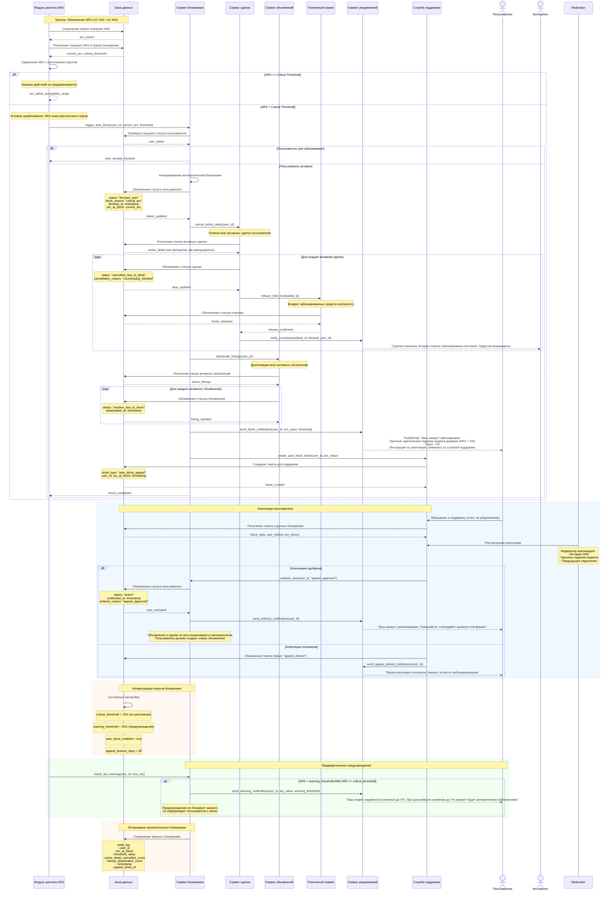

```mermaid
    sequenceDiagram
    participant ARSEngine as Модуль расчета ARS
    participant Database as База данных
    participant BlockingService as Сервис блокировки
    participant DealService as Сервис сделок
    participant ListingService as Сервис объявлений
    participant PaymentService as Платежный сервис
    participant NotifyService as Сервис уведомлений
    participant SupportService as Служба поддержки
    actor User as Пользователь
    actor Counterparty as Контрагент

    Note over ARSEngine,Database: Триггер: Обновление ARS (UC-105 / UC-405)

    ARSEngine->>Database: Сохранение нового значения ARS
    Database-->>ARSEngine: ars_saved
    
    ARSEngine->>Database: Получение текущего ARS и порога блокировки
    Database-->>ARSEngine: current_ars, critical_threshold
    
    ARSEngine->>ARSEngine: Сравнение ARS с критическим порогом
    
    alt ARS >= Critical Threshold
        Note over ARSEngine: Никаких действий не предпринимается
        ARSEngine-->>ARSEngine: ars_within_acceptable_range
        
    else ARS < Critical Threshold
        Note over ARSEngine: Условие срабатывания: ARS ниже критического порога
        
        ARSEngine->>BlockingService: trigger_auto_block(user_id, current_ars, threshold)
        
        BlockingService->>Database: Проверка текущего статуса пользователя
        Database-->>BlockingService: user_status
        
        alt Пользователь уже заблокирован
            BlockingService-->>ARSEngine: user_already_blocked
        else Пользователь активен
            BlockingService->>BlockingService: Инициирование автоматической блокировки
            
            BlockingService->>Database: Обновление статуса пользователя
            Note over Database: status: "blocked_auto"<br/>block_reason: "critical_ars"<br/>blocked_at: timestamp<br/>ars_at_block: current_ars
            Database-->>BlockingService: status_updated
            
            BlockingService->>DealService: cancel_active_deals(user_id)
            Note over DealService: Отмена всех активных сделок пользователя
            
            DealService->>Database: Получение списка активных сделок
            Database-->>DealService: active_deals (как арендатор, как арендодатель)
            
            loop Для каждой активной сделки
                DealService->>Database: Обновление статуса сделки
                Note over Database: status: "cancelled_due_to_block"<br/>cancellation_reason: "counterparty_blocked"
                Database-->>DealService: deal_updated
                
                DealService->>PaymentService: release_held_funds(deal_id)
                Note over PaymentService: Возврат заблокированных средств контрагенту
                PaymentService->>Database: Обновление статуса платежа
                Database-->>PaymentService: funds_released
                PaymentService-->>DealService: release_confirmed
                
                DealService->>NotifyService: notify_counterparty(deal_id, blocked_user_id)
                NotifyService-->>Counterparty: "Сделка отменена. Вторая сторона заблокирована системой. Средства возвращены"
            end
            
            BlockingService->>ListingService: deactivate_listings(user_id)
            Note over ListingService: Деактивация всех активных объявлений
            
            ListingService->>Database: Получение списка активных объявлений
            Database-->>ListingService: active_listings
            
            loop Для каждого активного объявления
                ListingService->>Database: Обновление статуса объявления
                Note over Database: status: "inactive_due_to_block"<br/>deactivated_at: timestamp
                Database-->>ListingService: listing_updated
            end
            
            BlockingService->>NotifyService: send_block_notification(user_id, ars_value, threshold)
            NotifyService-->>User: Push/Email: "Ваш аккаунт заблокирован"<br/>Причина: критическое падение индекса доверия (ARS = X%)<br/>Порог: Y%<br/>Инструкция по апелляции: свяжитесь со службой поддержки
            
            BlockingService->>SupportService: create_auto_block_ticket(user_id, ars_value)
            SupportService->>Database: Создание тикета для поддержки
            Note over Database: ticket_type: "auto_block_appeal"<br/>user_id, ars_at_block, timestamp
            Database-->>SupportService: ticket_created
            
            BlockingService-->>ARSEngine: block_completed
        end
    end
    
    rect rgb(240, 248, 255)
        Note over Database,SupportService: Апелляция пользователя
        
        User->>SupportService: Обращение в поддержку (ответ на уведомление)
        SupportService->>Database: Получение тикета и данных блокировки
        Database-->>SupportService: block_data, user_history, ars_history
        
        Moderator->>SupportService: Рассмотрение апелляции
        Note over Moderator: Модератор анализирует:<br/>- Историю ARS<br/>- Причины падения индекса<br/>- Предыдущие нарушения
        
        alt Апелляция одобрена
            SupportService->>BlockingService: unblock_user(user_id, "appeal_approved")
            BlockingService->>Database: Обновление статуса пользователя
            Note over Database: status: "active"<br/>unblocked_at: timestamp<br/>unblock_reason: "appeal_approved"
            Database-->>BlockingService: user_activated
            
            BlockingService->>NotifyService: send_unblock_notification(user_id)
            NotifyService-->>User: "Ваш аккаунт разблокирован. Пожалуйста, соблюдайте правила платформы"
            
            Note over BlockingService: Объявления и сделки не восстанавливаются автоматически<br/>Пользователь должен создать новые объявления
            
        else Апелляция отклонена
            SupportService->>Database: Обновление тикета (status: "appeal_denied")
            SupportService->>NotifyService: send_appeal_denied_notification(user_id)
            NotifyService-->>User: "Ваша апелляция отклонена. Аккаунт остается заблокированным"
        end
    end
    
    rect rgb(255, 248, 240)
        Note over BlockingService,Database: Конфигурация порогов блокировки
        
        Database->>Database: Системные настройки:<br/>
        Note over Database: critical_threshold = 15% (по умолчанию)<br/>
        Note over Database: warning_threshold = 25% (предупреждение)<br/>
        Note over Database: auto_block_enabled = true<br/>
        Note over Database: appeal_timeout_days = 30
    end
    
    rect rgb(240, 255, 240)
        Note over BlockingService,User: Предварительное предупреждение
        
        ARSEngine->>BlockingService: check_ars_warning(user_id, new_ars)
        
        alt ARS < warning_threshold AND ARS >= critical_threshold
            BlockingService->>NotifyService: send_warning_notification(user_id, ars_value, warning_threshold)
            NotifyService-->>User: "Ваш индекс надежности снизился до X%. При дальнейшем снижении до Y% аккаунт будет автоматически заблокирован"
            Note over BlockingService: Предупреждение не блокирует аккаунт,<br/>но информирует пользователя о риске
        end
    end
    
    rect rgb(255, 248, 240)
        Note over BlockingService,Database: Логирование автоматических блокировок
        
        BlockingService->>Database: Сохранение записи о блокировке
        Note over Database: audit_log:<br/>- user_id<br/>- ars_at_block<br/>- threshold_value<br/>- active_deals_cancelled_count<br/>- listings_deactivated_count<br/>- timestamp<br/>- appeal_ticket_id
    end

```