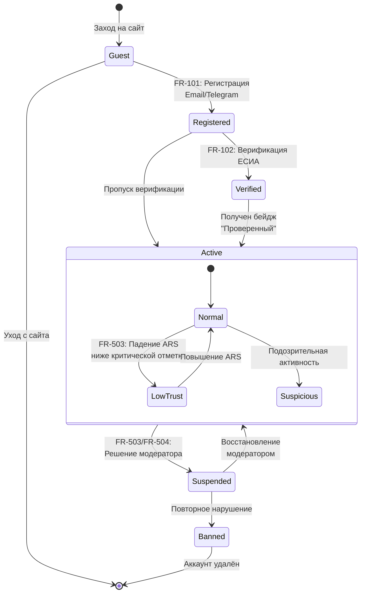

```mermaid
    stateDiagram-v2
    [*] --> Guest: Заход на сайт

    Guest --> Registered: FR-101: Регистрация<br/>Email/Telegram
    Guest --> [*]: Уход с сайта
   
    Registered --> Verified: FR-102: Верификация ЕСИА
    Registered --> Active: Пропуск верификации
   
    Verified --> Active: Получен бейдж<br/>"Проверенный"
   
    state Active {
        [*] --> Normal
        Normal --> LowTrust: FR-503: Падение ARS<br/>ниже критической отметки
        Normal --> Suspicious: Подозрительная активность
        LowTrust --> Normal: Повышение ARS
    }
   
    Active --> Suspended: FR-503/FR-504:<br/>Решение модератора
    Suspended --> Active: Восстановление<br/>модератором
    Suspended --> Banned: Повторное нарушение
   
    Banned --> [*]: Аккаунт удалён

```