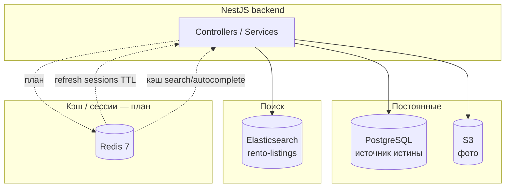

# Архитектура данных Rento

**Источник схемы PostgreSQL:** `packages/backend/prisma/schema.prisma`  
Идентификаторы — **UUID** (`String @id @default(uuid())`).

## Слои хранения



| Хранилище         | Роль                                                         | Статус                                       |
| ----------------- | ------------------------------------------------------------ | -------------------------------------------- |
| **PostgreSQL**    | Пользователи, объявления, брони, платежи, trust, верификация | Реализовано                                  |
| **Elasticsearch** | Полнотекстовый индекс ACTIVE-объявлений                      | Реализовано                                  |
| **S3**            | Бинарные фото `ListingPhoto`                                 | Реализовано                                  |
| **Redis**         | Сессии (refresh), кэш ES-выдачи, rate limit                  | **План** — [redis-plan.md](../redis-plan.md) |
| **Ollama**        | LLM-модерация (HTTP, не БД)                                  | Реализовано                                  |

---

## ER-диаграмма (PostgreSQL)

```mermaid
erDiagram
    User ||--o{ Listing : owns
    User ||--o{ Booking : rents
    User ||--o| IdentityVerification : has
    User ||--o| TrustScore : has
    User ||--o{ UserPaymentMethod : has
    User ||--o{ RefreshToken : has
    User ||--o{ EmailConfirmationToken : has
    User ||--o{ TelegramLinkCode : has
    User ||--o{ TelegramLoginExchangeCode : has

    Category ||--o{ Listing : categorizes
    Listing ||--o{ ListingPhoto : has
    Listing ||--o{ ListingManualCalendarBlock : blocks
    Listing ||--o{ Booking : receives

    TelegramLoginAttempt ||--o{ TelegramLoginExchangeCode : issues

    User {
        uuid id PK
        string email UK
        string passwordHash
        string fullName
        string phone
        string avatarUrl
        string addressText
        float addressLatitude
        float addressLongitude
        enum role
        enum status
        datetime emailConfirmedAt
        string telegramId UK
        datetime createdAt
        datetime updatedAt
    }

    RefreshToken {
        uuid id PK
        uuid userId FK
        string tokenHash
        datetime expiresAt
        datetime revokedAt
        datetime createdAt
    }

    IdentityVerification {
        uuid id PK
        uuid userId FK UK
        string provider
        enum status
        datetime verifiedAt
        datetime expiresAt
        string lastError
    }

    TrustScore {
        uuid id PK
        uuid userId FK UK
        int currentScore
        int totalDeals
        int successfulDeals
        int lateReturns
        int disputes
        datetime calculatedAt
    }

    Category {
        uuid id PK
        string name
        string slug UK
        string icon
        int order
        boolean isActive
    }

    Listing {
        uuid id PK
        uuid ownerId FK
        uuid categoryId FK
        string title
        string description
        float rentalPrice
        enum rentalPeriod
        float depositAmount
        enum status
        string addressText
        float latitude
        float longitude
        enum moderationStatus
        json moderationReasons
        int moderationVersion
        float moderationConfidence
    }

    ListingPhoto {
        uuid id PK
        uuid listingId FK
        string url
        string thumbnailUrl
        int order
        boolean isPrimary
    }

    ListingManualCalendarBlock {
        uuid id PK
        uuid listingId FK
        date startDate
        date endDate
        string reason
    }

    Booking {
        uuid id PK
        uuid listingId FK
        uuid renterId FK
        date startDate
        date endDate
        datetime startAt
        datetime endAt
        float totalAmount
        string paymentHoldId
        enum status
        enum settlementStatus
        datetime completedAt
    }

    UserPaymentMethod {
        uuid id PK
        uuid userId FK
        string token
        string last4
        enum status
    }
```

### RefreshToken и Redis (план)

| Сейчас                                                | После Redis                                                 |
| ----------------------------------------------------- | ----------------------------------------------------------- |
| Каждый login создаёт строку `RefreshToken` в Postgres | Активная сессия в `rento:session:{sessionId}` (TTL 30 дней) |
| Нет `POST /auth/refresh`                              | Refresh по Redis + ротация токена                           |
| Access JWT 15 мин, фронт не обновляет                 | Silent refresh в `apiClient`                                |

Таблица `RefreshToken` может остаться для аудита или быть выведена из hot path — см. [redis-plan.md](../redis-plan.md).

---

## Календарь доступности

Отдельной таблицы «слотов» нет. Занятость:

1. **`Booking`** — блокирующие статусы (см. [state/Booking.md](../state/Booking.md));
2. **`ListingManualCalendarBlock`** — ручные блоки владельца.

---

## Категории (production)

Справочник `Category`: «Для ремонта», «Для детей», «Для авто», «Для дома», «Для питомцев», «Для хобби», «Разное» (`dlya-remonta` … `raznoe`).

Кэш списка категорий в Redis (план): ключ `rento:categories:active`, инвалидация при изменении `Category`.
