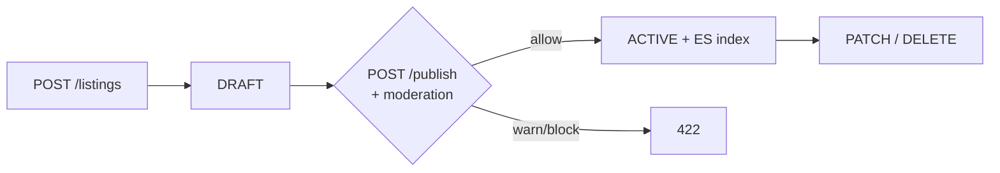
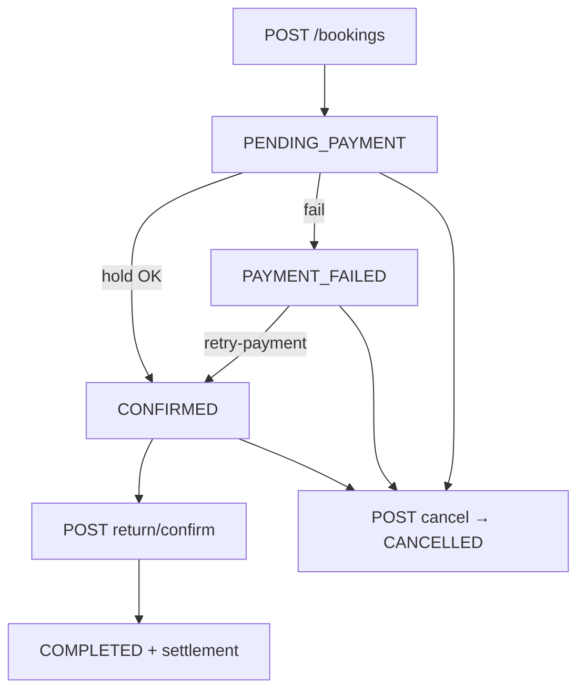

# Доменная логика платформы

Соответствует коду в `packages/backend`. Расширения из ТЗ (чат, отзывы, споры) помечены **запланировано**.

---

## Модули

| Модуль             | Сущности Prisma                                                            | Статус                       |
| ------------------ | -------------------------------------------------------------------------- | ---------------------------- |
| **Core**           | User, Listing, Category, Booking, ListingPhoto, ListingManualCalendarBlock | Реализовано                  |
| **Trust & verify** | IdentityVerification, TrustScore                                           | Реализовано                  |
| **Payments**       | UserPaymentMethod, поля hold/settlement в Booking                          | Частично (hold + settlement) |
| **Search**         | — (ES индекс `rento-listings`)                                             | Реализовано                  |
| **Moderation**     | поля moderation\* на Listing                                               | Реализовано (текст, auto)    |
| **Social**         | Review, Chat                                                               | Запланировано                |
| **Disputes**       | BookingStatus.DISPUTED                                                     | Запланировано                |

---

## User

- Регистрация: `PENDING_EMAIL_CONFIRMATION` → `ACTIVE` после email.
- Telegram: link (`/telegram/link` + `/telegram/verify`) или web login (`/telegram/login/*`) или bot (`/telegram/auth`).
- Профиль: `PATCH /users/me`, геокодирование адреса через `POST /geo/geocode`.

---

## Listing

**Цена:** одно поле `rentalPrice` + `rentalPeriod` (`HOUR` | `DAY` | `WEEK` | `MONTH`), не три отдельных pricePerDay/Week/Month.

**Жизненный цикл:**

**Фото:** до 10 шт., `POST /listings/:id/photos` → S3.

**Календарь:** ручные блоки + занятость от Booking (см. CalendarService).

---

## Booking

Отдельного статуса «ожидание подтверждения владельцем» нет — после успешного холда сразу `CONFIRMED`.

---

## Search

1. `GET /search` → Elasticsearch (ACTIVE).
2. ID из ES → загрузка карточек из Postgres.
3. Fallback на Postgres при ошибке ES / пустой выдаче / односимвольном запросе.
4. `GET /search/autocomplete` → подсказки из ES.

Демо-каталог: только при `CATALOG_DEFAULT_SEED_ENABLED=true` (по умолчанию **false**).

---

## Moderation (текст)

Rules → (optional) Ollama → fusion. Подробно: [moderation-draft-ai.md](../moderation-draft-ai.md).

---

## Запланировано (ТЗ)

| Функция               | UC    |
| --------------------- | ----- |
| Избранное             | UC-12 |
| Рекомендации          | UC-11 |
| Карта / geo search UI | UC-10 |
| Handover с чек-листом | UC-14 |
| Чат сделки            | UC-18 |
| Формальный спор       | UC-19 |
| Отзывы                | UC-17 |
| Панель модератора     | UC-21 |

При проектировании новых фич сверяйтесь с `packages/backend/src/**/*.controller.ts`.
