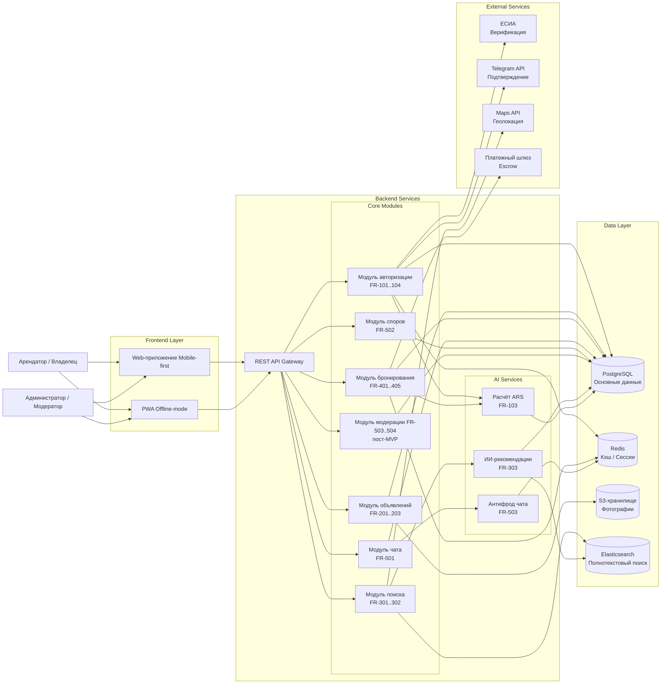

```mermaid
    flowchart LR
    %% Пользователи
    User[Арендатор / Владелец]
    Admin[Администратор / Модератор]
    
    subgraph Frontend [Frontend Layer]
     Web[Web-приложение Mobile-first]
     PWA[PWA Offline-mode]
     end
    
    subgraph Backend [Backend Services]
     direction TB
     API[REST API Gateway]
    
     subgraph Core [Core Modules]
      Auth[Модуль авторизации<br/>FR-101..104]
      Listing[Модуль объявлений<br/>FR-201..203]
      Search[Модуль поиска<br/>FR-301..302]
      Booking[Модуль бронирования<br/>FR-401..405]
      Chat[Модуль чата<br/>FR-501]
      Dispute[Модуль споров<br/>FR-502]
      Moderation[Модуль модерации FR-503..504<br/>пост-MVP]
     end
    
     subgraph AI [AI Services]
      Recommender[ИИ-рекомендации<br/>FR-303]
       TrustScore[Расчёт ARS<br/>FR-103]
       FraudDetection[Антифрод чата<br/>FR-503]
      end
     end

    subgraph External [External Services]
      ESIA[ЕСИА<br/>Верификация]
      Telegram[Telegram API<br/>Подтверждение]
         MapsAPI[Maps API<br/>Геолокация]
         Payment[Платежный шлюз<br/>Escrow]
     end
    
    subgraph Storage [Data Layer]
      PostgreSQL[(PostgreSQL<br/>Основные данные)]
      Redis[(Redis<br/>Кэш / Сессии)]
      S3[(S3-хранилище<br/>Фотографии)]
      Elastic[(Elasticsearch<br/>Полнотекстовый поиск)]
     end
    
    %% Соединения
     User --> Web
     User --> PWA
     Admin --> Web
    Admin --> PWA

     Web --> API
     PWA --> API
    
     API --> Auth
     API --> Listing
     API --> Search
     API --> Booking
     API --> Chat
     API --> Dispute
     API --> Moderation
    
     Search --> Recommender
     Auth --> TrustScore
     Chat --> FraudDetection
     Booking --> TrustScore
    
     Auth --> ESIA
     Auth --> Telegram
     Search --> MapsAPI
     Booking --> Payment
    
     Auth --> PostgreSQL
     Auth --> Redis
     Listing --> PostgreSQL
     Listing --> S3
     Search --> Elastic
     Booking --> PostgreSQL
     Booking --> Redis
     Chat --> PostgreSQL
     Dispute --> PostgreSQL
     Moderation --> PostgreSQL
    
     Recommender --> Elastic
     Recommender --> PostgreSQL
     TrustScore --> PostgreSQL
     FraudDetection --> Redis
```