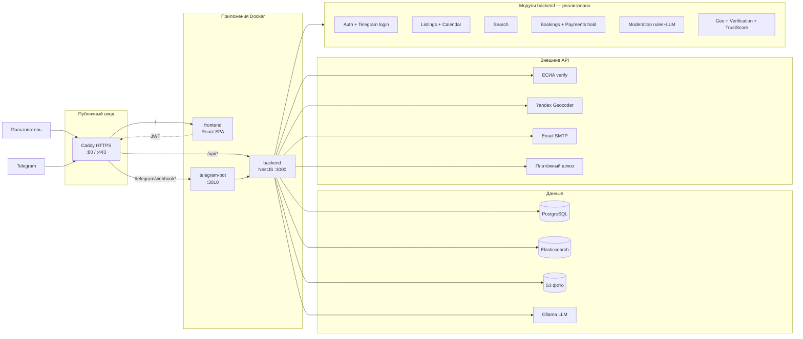

# Архитектура системы (production)

Соответствует `deploy/docker-compose.yml` и модулям NestJS.

## Не в текущем production-стеке

| Компонент                                | Статус                                     |
| ---------------------------------------- | ------------------------------------------ |
| Redis (сессии/кэш)                       | Не используется — JWT + refresh в Postgres |
| Chat / WebSocket                         | Запланировано                              |
| Dispute / Report admin                   | Запланировано                              |
| ИИ-рекомендации (`GET /recommendations`) | Запланировано                              |
| PWA offline                              | Запланировано                              |

## Переменные окружения (ключевые)

| Сервис       | Примеры                                                                                              |
| ------------ | ---------------------------------------------------------------------------------------------------- |
| backend      | `DATABASE_URL`, `ELASTICSEARCH_NODE`, `MODERATION_LLM_*`, `S3_*`, `JWT_*`, `YANDEX_GEOCODER_API_KEY` |
| telegram-bot | `BOT_TOKEN`, `BOT_SECRET`, `PUBLIC_BOT_BASE_URL`, `BACKEND_BASE_URL`                                 |
| compose      | `CATALOG_DEFAULT_SEED_ENABLED=false` (демо-каталог выключен)                                         |
