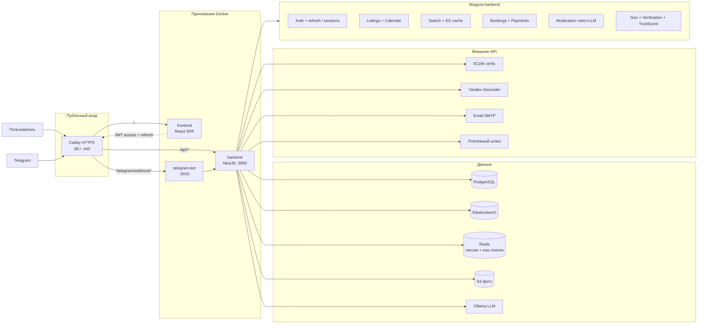

# Архитектура системы (production)

Соответствует `deploy/docker-compose.yml`. **Redis** — по [redis-plan.md](../redis-plan.md) (внедрение в работе).

## Потоки через Redis (план)

| Поток                | Redis               | Postgres / ES          |
| -------------------- | ------------------- | ---------------------- |
| Login                | `SET session:{sid}` | User                   |
| `POST /auth/refresh` | read/rotate session | User status            |
| `GET /search`        | cache hit → skip ES | miss → ES + hydrate PG |
| Publish listing      | `DEL search:*`      | UPDATE + ES index      |

## Статус компонентов

| Компонент                  | Статус                                            |
| -------------------------- | ------------------------------------------------- |
| PostgreSQL, ES, S3, Ollama | Реализовано                                       |
| Redis                      | Запланировано ([redis-plan.md](../redis-plan.md)) |
| Chat / WebSocket           | Запланировано                                     |
| Панель модератора          | Запланировано                                     |

## Переменные окружения (ключевые)

| Сервис       | Примеры                                                                                |
| ------------ | -------------------------------------------------------------------------------------- |
| backend      | `DATABASE_URL`, `ELASTICSEARCH_NODE`, `REDIS_URL`, `JWT_*`, `MODERATION_LLM_*`, `S3_*` |
| telegram-bot | `BOT_TOKEN`, `BOT_SECRET`, `BACKEND_BASE_URL`                                          |
| compose      | `CATALOG_DEFAULT_SEED_ENABLED=false`                                                   |
