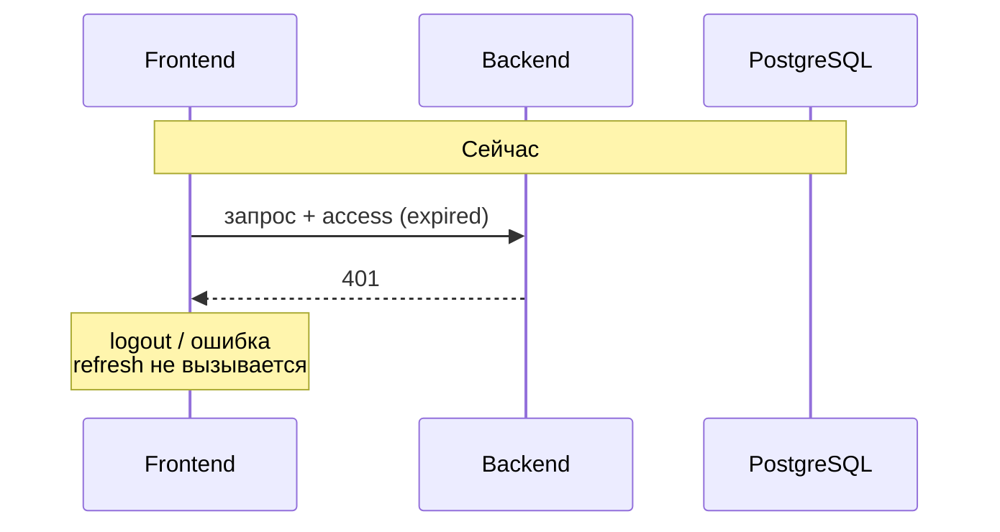
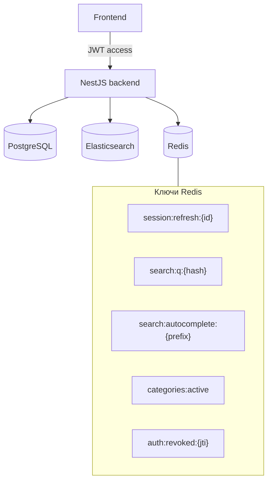
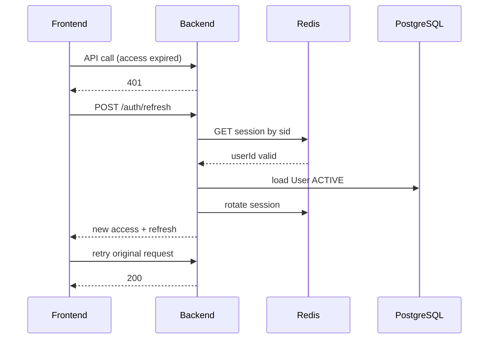

# План внедрения Redis

Цели:

1. **Сессии не «вылетают»** — автоматическое продление access-токена через refresh, единое хранилище сессий с TTL.
2. **Снять нагрузку с Elasticsearch** — кэш ответов поиска и автодополнения с инвалидацией при изменении объявлений.

## Текущее состояние (проблема)

| Компонент            | Сейчас                                                           |
| -------------------- | ---------------------------------------------------------------- |
| Access JWT           | TTL **15 мин** (`ACCESS_TOKEN_TTL_SECONDS`)                      |
| Refresh JWT          | TTL 30 дней, хэш пишется в таблицу `RefreshToken` (Postgres)     |
| `POST /auth/refresh` | **Нет** — refresh-токен на фронте есть, но не используется       |
| Фронт                | `localStorage`: access + refresh; при 401 **нет** silent refresh |
| Поиск                | Каждый `GET /search` → запрос в ES + гидратация из Postgres      |

Итог: через 15 минут access истекает → API отвечает 401 → пользователь «разлогинен», хотя refresh ещё валиден.



## Целевая архитектура



| Назначение Redis          | Префикс ключа                      | TTL                       |
| ------------------------- | ---------------------------------- | ------------------------- |
| Refresh-сессия            | `rento:session:{sessionId}`        | 30 дней (как refresh JWT) |
| Кэш поиска                | `rento:search:v1:{sha256(params)}` | 30–120 с                  |
| Автодополнение            | `rento:autocomplete:v1:{prefix}`   | 60 с                      |
| Категории каталога        | `rento:categories:active`          | 5–15 мин                  |
| Blacklist access (logout) | `rento:auth:revoked:{jti}`         | до exp access             |

Postgres остаётся **источником истины** для User, Listing, Booking. Redis — **эфемерный слой** (сессии + кэш).

---

## Этап 1 — Инфраструктура

**Статус:** подключено безопасной основой.

- `redis` добавлен в `deploy/docker-compose.yml` и `packages/backend/docker-compose.dev.yml`;
- backend получил `RedisModule`, `RedisService`, `GET /health/redis`;
- `.env.example` держит `REDIS_ENABLED=false`, чтобы локально ничего не ломалось без Redis;
- production compose передаёт `REDIS_ENABLED=true`, `REDIS_URL=redis://redis:6379`;
- сессии и поиск пока **не переключены** на Redis.

### 1.1 Docker Compose

**Файлы:** `deploy/docker-compose.yml`, `packages/backend/docker-compose.dev.yml`

```yaml
redis:
  image: redis:7-alpine
  container_name: rento-redis
  restart: unless-stopped
  command: redis-server --appendonly yes --maxmemory 256mb --maxmemory-policy allkeys-lru
  volumes:
    - rento_redis_data:/data
  healthcheck:
    test: ["CMD", "redis-cli", "ping"]
    interval: 5s
    timeout: 3s
    retries: 10
  networks:
    - internal
```

- `backend.depends_on`: `redis` (healthy)
- Сеть: только `internal` (как postgres / elasticsearch)

### 1.2 Переменные окружения

| Переменная         | Пример                   | Описание                      |
| ------------------ | ------------------------ | ----------------------------- |
| `REDIS_URL`        | `redis://redis:6379`     | Production (Docker DNS)       |
| `REDIS_URL`        | `redis://localhost:6379` | Локально                      |
| `REDIS_KEY_PREFIX` | `rento`                  | Префикс всех ключей           |
| `REDIS_ENABLED`    | `true`                   | Feature flag на первом релизе |

Добавить в `packages/backend/.env.example` и `deploy/.env`.

### 1.3 NestJS

- Пакет: `ioredis` или `@nestjs-modules/ioredis` / `cache-manager` + `cache-manager-ioredis-yet`
- Модуль: `RedisModule` (global), `RedisService` с `get` / `set` / `del` / `setex`
- Health: `GET /health/redis` → `PING`

**Оценка:** 0.5–1 день.

---

## Этап 2 — Сессии (главная цель)

### 2.1 Модель сессии в Redis

При `issueTokenPair` (login, confirm-email, telegram exchange):

1. Сгенерировать `sessionId` (uuid).
2. Записать в Redis:

```json
// KEY: rento:session:{sessionId}
{
  "userId": "...",
  "refreshTokenHash": "sha256...",
  "userAgent": "...",
  "createdAt": "ISO"
}
```

3. В refresh JWT payload добавить claim `sid: sessionId` (и опционально `jti` для access).

4. **Postgres `RefreshToken`:** на переходный период — дублировать запись; после стабилизации — перестать писать или оставить только audit.

### 2.2 Новые эндпоинты

| Метод  | Путь               | Действие                                                              |
| ------ | ------------------ | --------------------------------------------------------------------- |
| `POST` | `/auth/refresh`    | Body: `{ refreshToken }` → новая пара access+refresh, ротация refresh |
| `POST` | `/auth/logout`     | JWT + refresh: удалить `rento:session:{sid}`, revoke                  |
| `POST` | `/auth/logout-all` | Удалить все сессии user (опционально)                                 |

**Правила refresh rotation:**

- При успешном refresh — удалить старый `sessionId`, создать новый (защита от reuse).
- При повторном использовании старого refresh — инвалидировать все сессии user (опционально, security).

### 2.3 Access token

- Оставить короткий TTL (15 мин) **или** увеличить до 1 ч после работающего refresh.
- Logout: положить `jti` в `rento:auth:revoked:{jti}` до `exp` — проверка в `JwtAuthGuard`.

### 2.4 Frontend

**Файлы:** `packages/frontend/src/lib/apiClient.ts`, `AuthContext.tsx`

1. Очередь запросов при refresh (один inflight refresh).
2. На 401 (кроме `/auth/refresh`): вызвать `POST /auth/refresh` с `refreshToken` из storage → обновить access → повторить запрос.
3. При неудаче refresh → `clearSession()` + редирект на login.
4. Опционально: proactive refresh за 1–2 мин до `exp` (decode JWT на клиенте).



**Оценка:** 2–3 дня (backend + frontend + тесты).

---

## Этап 3 — Кэш Elasticsearch / поиска

### 3.1 Что кэшировать

| Запрос                               | Ключ                                                         | TTL   | Инвалидация                   |
| ------------------------------------ | ------------------------------------------------------------ | ----- | ----------------------------- |
| `GET /search?...`                    | hash всех query-параметров (без user-specific если возможно) | 60 с  | publish/update/delete listing |
| `GET /search/autocomplete?q=`        | normalize(prefix)                                            | 60 с  | то же                         |
| `popularCategories` (пустой каталог) | `rento:categories:active`                                    | 300 с | CRUD Category                 |

**Важно:** для авторизованного поиска `excludeOwnerId` — включать в hash, иначе утечка чужих карточек в кэше.

### 3.2 Реализация в `SearchService`

```text
search(dto):
  key = buildSearchCacheKey(dto, excludeOwnerId)
  cached = redis.get(key)
  if (cached) return JSON.parse(cached)

  result = await searchElasticsearch(...) // как сейчас
  await redis.setex(key, SEARCH_CACHE_TTL_SEC, JSON.stringify(result))
  return result
```

### 3.3 Инвалидация

В `ListingSearchIndexService` после `indexListing` / delete:

```text
redis.delByPattern('rento:search:v1:*')   // простой вариант v1
// или точечно: del keys by listingId index (сложнее)
```

На первом этапе допустим **глобальный сброс** кэша поиска при любом изменении ACTIVE-объявления (простота > точность).

### 3.4 Дополнительно (этап 3b)

- Кэш только **orderedIds + total** из ES, гидратация из PG всегда свежая (меньше риск устаревших цен).
- Rate limit: `rento:rl:search:{ip}` — 60 req/min.

**Оценка:** 1.5–2 дня.

---

## Этап 4 — Прочие TTL-сценарии (опционально)

| Данные                 | Сейчас                          | Redis                                    |
| ---------------------- | ------------------------------- | ---------------------------------------- |
| Telegram login `state` | Postgres `TelegramLoginAttempt` | Redis TTL 15 мин (меньше нагрузка на PG) |
| Email confirm token    | Postgres                        | можно оставить в PG                      |
| Геокодер               | нет кэша                        | `rento:geo:{hash}` TTL 24 ч              |

---

## Изменения в схеме БД (docs / Prisma)

Таблица **`RefreshToken`** в Postgres:

- **Краткосрочно:** остаётся, дублирует Redis (миграция без breaking change).
- **Долгосрочно:** удалить запись при login из PG **или** оставить только `revokedAt` audit — активные сессии только в Redis.

В [architectureOfDB/architectureDB.md](architectureOfDB/architectureDB.md) Redis описан как отдельный слой; ER PostgreSQL не меняется, кроме пометки к `RefreshToken`.

---

## Порядок внедрения (рекомендуемый)

| #   | Задача                                | Приоритет | Зависимости  |
| --- | ------------------------------------- | --------- | ------------ |
| 1   | Redis в compose + health              | P0        | —            |
| 2   | `POST /auth/refresh` + rotation       | P0        | Redis        |
| 3   | Frontend silent refresh               | P0        | п.2          |
| 4   | `POST /auth/logout` + revoke          | P1        | п.2          |
| 5   | Кэш `GET /search` + invalidate        | P1        | Redis        |
| 6   | Кэш autocomplete + categories         | P2        | п.5          |
| 7   | Убрать дублирование RefreshToken в PG | P3        | п.2 стабилен |
| 8   | Telegram state → Redis                | P3        | —            |

## Критерии приёмки

- [ ] Пользователь остаётся залогиненным **> 15 мин** при активности (refresh срабатывает).
- [ ] После logout refresh не принимается.
- [ ] Повторный `GET /search` с теми же параметрами не бьёт ES (метрика/cache hit).
- [ ] После `publish` объявления кэш поиска сбрасывается, новое объявление видно ≤ TTL.
- [ ] `deploy/docker-compose.yml` поднимает `rento-redis`, backend стартует с `REDIS_URL`.

## Риски

| Риск                    | Митигация                                                                     |
| ----------------------- | ----------------------------------------------------------------------------- |
| Redis недоступен        | `REDIS_ENABLED=false` → fallback: refresh через PG как сейчас; поиск без кэша |
| Устаревший кэш каталога | Короткий TTL + инвалидация на index/delete                                    |
| Reuse stolen refresh    | Refresh rotation + invalidate family                                          |

## Связанные документы

- [architectureOfDB/architectureDB.md](architectureOfDB/architectureDB.md) — PostgreSQL + слои хранения
- [flowshart/flowchart.md](flowshart/flowchart.md) — диаграмма сервисов
- [sequence/UC-02.md](sequence/UC-02.md) — вход (обновить после реализации refresh)
