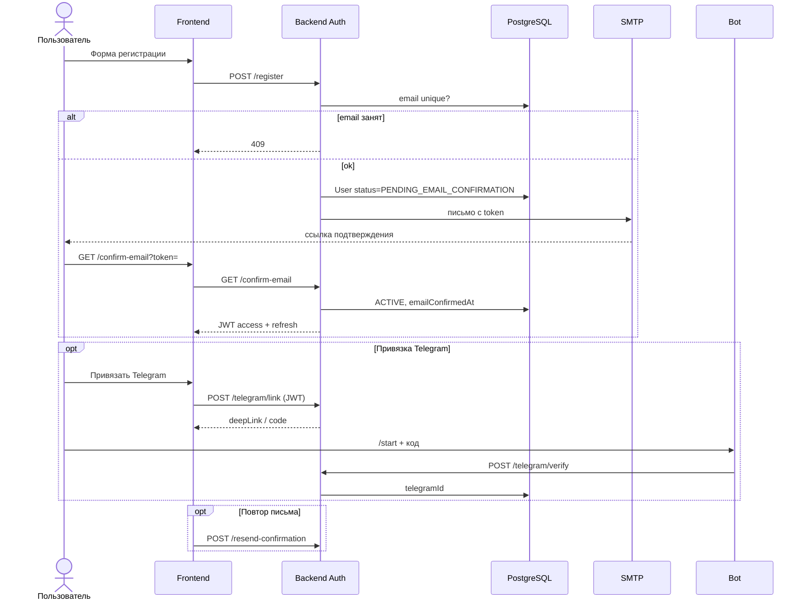

# UC-01 — Регистрация (email + опционально Telegram)

**Статус:** реализовано

```mermaid
sequenceDiagram
    actor User as Пользователь
    participant WebApp as Frontend
    participant API as Backend Auth
    participant DB as PostgreSQL
    participant Email as SMTP

    User->>WebApp: Форма регистрации
    WebApp->>API: POST /register
    API->>DB: email unique?
    alt email занят
        API-->>WebApp: 409
    else ok
        API->>DB: User status=PENDING_EMAIL_CONFIRMATION
        API->>Email: письмо с token
        Email-->>User: ссылка подтверждения
        User->>WebApp: GET /confirm-email?token=
        WebApp->>API: GET /confirm-email
        API->>DB: ACTIVE, emailConfirmedAt
        API-->>WebApp: JWT access + refresh
    end

    opt Привязка Telegram
        User->>WebApp: Привязать Telegram
        WebApp->>API: POST /telegram/link (JWT)
        API-->>WebApp: deepLink / code
        User->>Bot: /start + код
        Bot->>API: POST /telegram/verify
        API->>DB: telegramId
    end

    opt Повтор письма
        WebApp->>API: POST /resend-confirmation
    end
```
