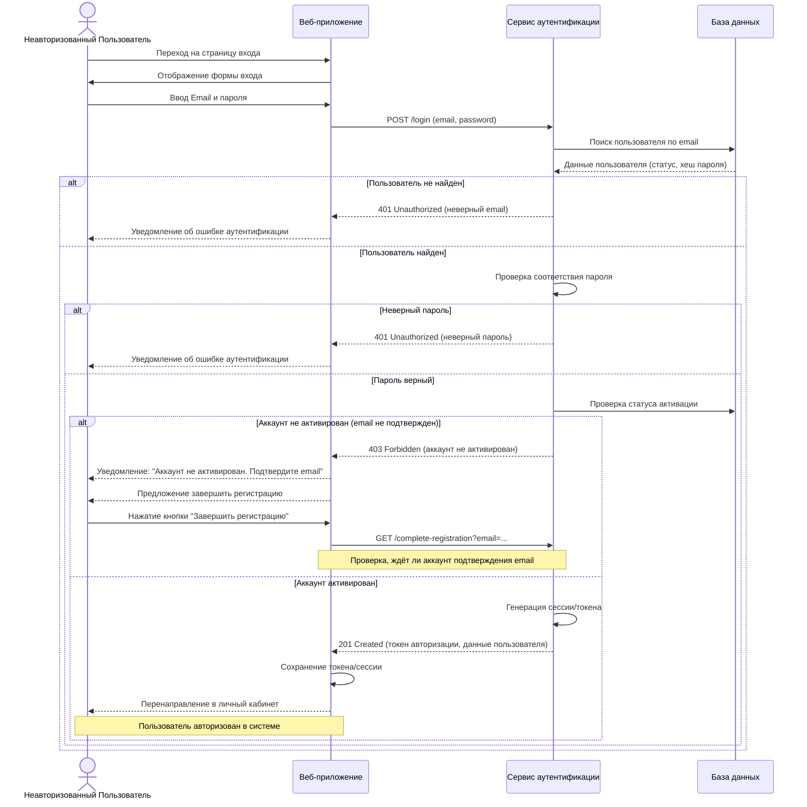

```mermaid
    sequenceDiagram
    actor User as Неавторизованный Пользователь
    participant WebApp as Веб-приложение
    participant AuthService as Сервис аутентификации
    participant Database as База данных

    User->>WebApp: Переход на страницу входа
    WebApp->>User: Отображение формы входа
    
    User->>WebApp: Ввод Email и пароля
    WebApp->>AuthService: POST /login (email, password)
    
    AuthService->>Database: Поиск пользователя по email
    Database-->>AuthService: Данные пользователя (статус, хеш пароля)
    
    alt Пользователь не найден
        AuthService-->>WebApp: 401 Unauthorized (неверный email)
        WebApp-->>User: Уведомление об ошибке аутентификации
    else Пользователь найден
        AuthService->>AuthService: Проверка соответствия пароля
        
        alt Неверный пароль
            AuthService-->>WebApp: 401 Unauthorized (неверный пароль)
            WebApp-->>User: Уведомление об ошибке аутентификации
        else Пароль верный
            AuthService->>Database: Проверка статуса активации
            
            alt Аккаунт не активирован (email не подтвержден)
                AuthService-->>WebApp: 403 Forbidden (аккаунт не активирован)
                WebApp-->>User: Уведомление: "Аккаунт не активирован. Подтвердите email"
                WebApp-->>User: Предложение завершить регистрацию
                User->>WebApp: Нажатие кнопки "Завершить регистрацию"
                WebApp->>AuthService: GET /complete-registration?email=...
                Note over WebApp,AuthService: Проверка, ждёт ли аккаунт подтверждения email
            else Аккаунт активирован
                AuthService->>AuthService: Генерация сессии/токена
                AuthService-->>WebApp: 201 Created (токен авторизации, данные пользователя)
                WebApp->>WebApp: Сохранение токена/сессии
                WebApp-->>User: Перенаправление в личный кабинет
                Note over User,WebApp: Пользователь авторизован в системе
            end
        end
    end

```