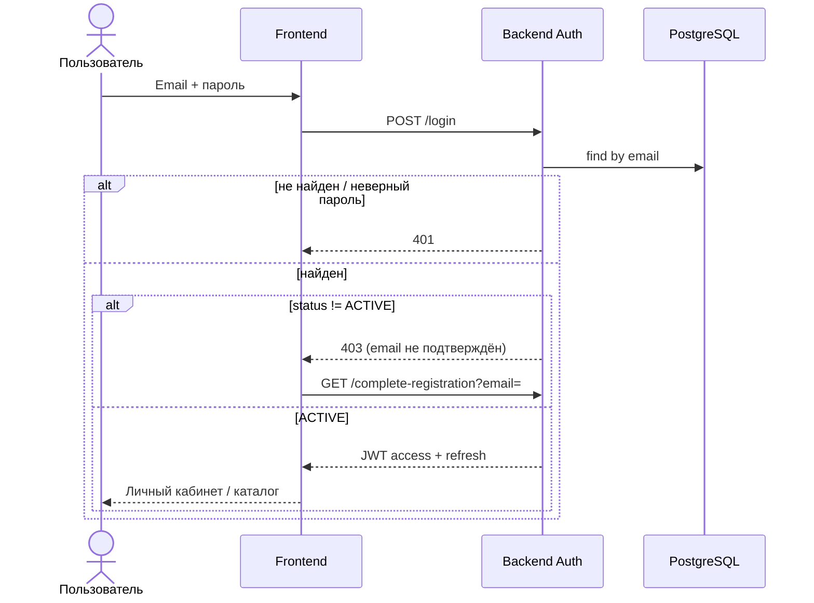

# UC-02 — Вход по email

**Статус:** реализовано

**Альтернатива:** вход через Telegram — UC-01 (web login: `/telegram/login/start` → bot → `/telegram/login/exchange`).

**План (Redis):** после внедрения — `POST /auth/refresh` при истечении access (15 мин), см. [redis-plan.md](../redis-plan.md).
