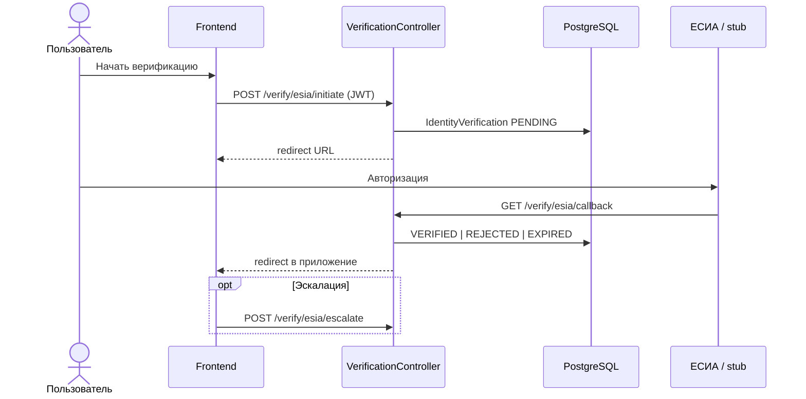

# UC-03 — Верификация личности (ЕСИА)

**Статус:** реализовано (включая stub для dev)

```mermaid
sequenceDiagram
    actor User as Пользователь
    participant WebApp as Frontend
    participant API as VerificationController
    participant DB as PostgreSQL
    participant ESIA as ЕСИА / stub

    User->>WebApp: Начать верификацию
    WebApp->>API: POST /verify/esia/initiate (JWT)
    API->>DB: IdentityVerification PENDING
    API-->>WebApp: redirect URL
    User->>ESIA: Авторизация
    ESIA->>API: GET /verify/esia/callback
    API->>DB: VERIFIED | REJECTED | EXPIRED
    API-->>WebApp: redirect в приложение

    opt Эскалация
        WebApp->>API: POST /verify/esia/escalate
    end
```

Состояния: [state/Verification.md](../state/Verification.md).
