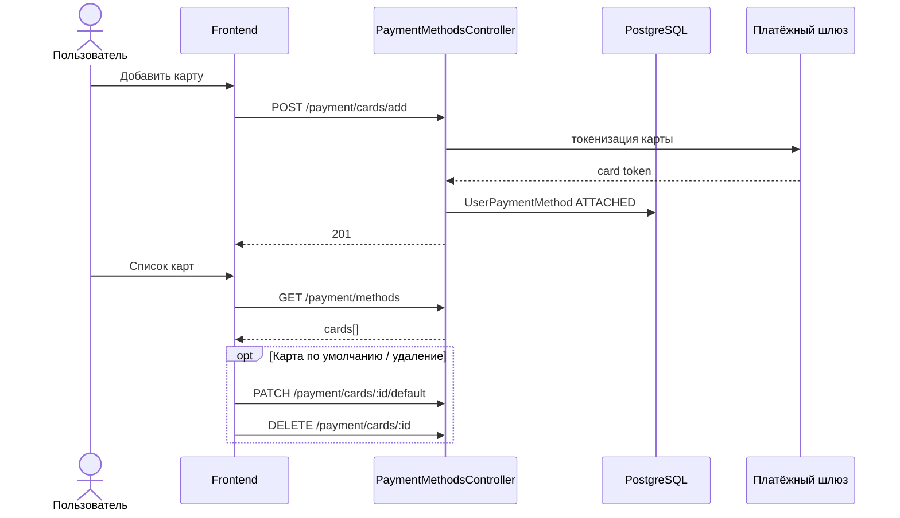

# UC-04 — Привязка банковской карты

**Статус:** реализовано

```mermaid
sequenceDiagram
    actor User as Пользователь
    participant WebApp as Frontend
    participant API as PaymentMethodsController
    participant DB as PostgreSQL
    participant GW as Платёжный шлюз

    User->>WebApp: Добавить карту
    WebApp->>API: POST /payment/cards/add
    API->>GW: токенизация карты
    GW-->>API: card token
    API->>DB: UserPaymentMethod ATTACHED
    API-->>WebApp: 201

    User->>WebApp: Список карт
    WebApp->>API: GET /payment/methods
    API-->>WebApp: cards[]

    opt Карта по умолчанию / удаление
        WebApp->>API: PATCH /payment/cards/:id/default
        WebApp->>API: DELETE /payment/cards/:id
    end
```

Используется при `POST /bookings` (холд аренда + залог).
