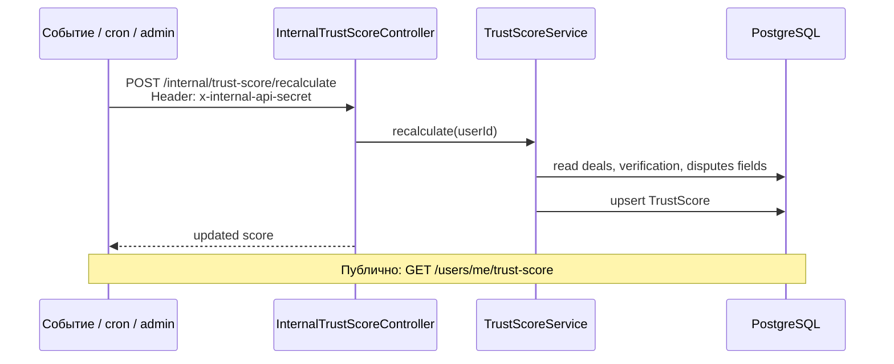

# UC-05 — Пересчёт Trust Score (ARS)

**Статус:** частично (модель + internal API; автотриггеры по сделкам — по мере развития)

```mermaid
sequenceDiagram
    participant Trigger as Событие / cron / admin
    participant API as InternalTrustScoreController
    participant Svc as TrustScoreService
    participant DB as PostgreSQL

    Trigger->>API: POST /internal/trust-score/recalculate<br/>Header: x-internal-api-secret
    API->>Svc: recalculate(userId)
    Svc->>DB: read deals, verification, disputes fields
    Svc->>DB: upsert TrustScore
    API-->>Trigger: updated score

    Note over Trigger,DB: Публично: GET /users/me/trust-score
```

Модель: `TrustScore` в Prisma. Отзывы (UC-17) пока не пишут в БД.
