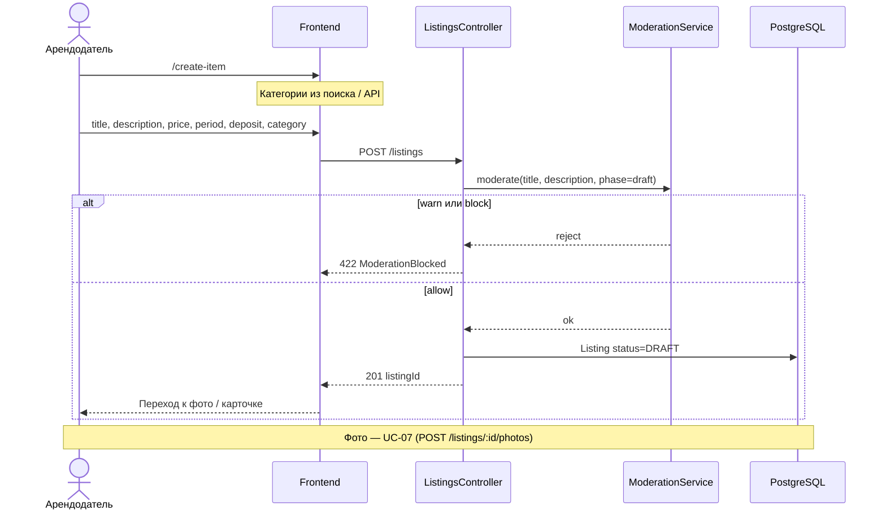

# UC-06 — Создание черновика объявления

**Статус:** реализовано (с автомодерацией текста)

```mermaid
sequenceDiagram
    actor Owner as Арендодатель
    participant WebApp as Frontend
    participant API as ListingsController
    participant Mod as ModerationService
    participant DB as PostgreSQL

    Owner->>WebApp: /create-item
    Note over WebApp: Категории из поиска / API
    Owner->>WebApp: title, description, price, period, deposit, category
    WebApp->>API: POST /listings

    API->>Mod: moderate(title, description, phase=draft)
    alt warn или block
        Mod-->>API: reject
        API-->>WebApp: 422 ModerationBlocked
    else allow
        Mod-->>API: ok
        API->>DB: Listing status=DRAFT
        API-->>WebApp: 201 listingId
        WebApp-->>Owner: Переход к фото / карточке
    end

    Note over Owner,DB: Фото — UC-07 (POST /listings/:id/photos)
```

`GET /listings/create` — справочные данные для формы (реализовано).
