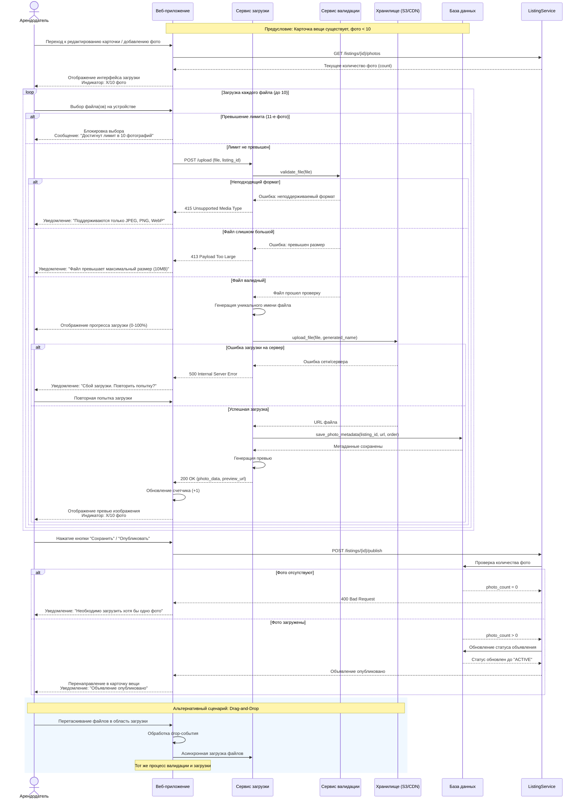

**MVP:** после `POST /listings/{id}/publish` объявление переходит в `ACTIVE` без очереди модерации. Значение `PENDING_MODERATION`, эндпоинты `/moderation/*` и сценарии панели модерации (например UC-21) относятся к **будущему этапу**, не к MVP.

