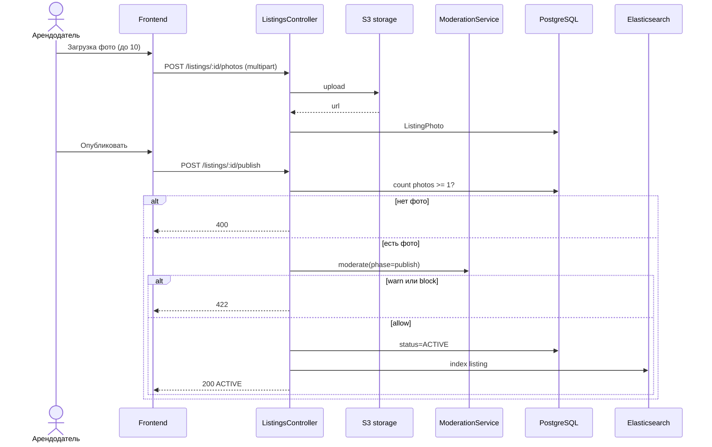

# UC-07 — Фото и публикация объявления

**Статус:** реализовано

```mermaid
sequenceDiagram
    actor Owner as Арендодатель
    participant WebApp as Frontend
    participant API as ListingsController
    participant S3 as S3 storage
    participant Mod as ModerationService
    participant DB as PostgreSQL
    participant ES as Elasticsearch

    Owner->>WebApp: Загрузка фото (до 10)
    WebApp->>API: POST /listings/:id/photos (multipart)
    API->>S3: upload
    S3-->>API: url
    API->>DB: ListingPhoto

    Owner->>WebApp: Опубликовать
    WebApp->>API: POST /listings/:id/publish

    API->>DB: count photos >= 1?
    alt нет фото
        API-->>WebApp: 400
    else есть фото
        API->>Mod: moderate(phase=publish)
        alt warn или block
            API-->>WebApp: 422
        else allow
            API->>DB: status=ACTIVE
            API->>ES: index listing
            API-->>WebApp: 200 ACTIVE
        end
    end
```

`PENDING_MODERATION` в enum **не используется** — публикация сразу в `ACTIVE` после успешной автомодерации.
