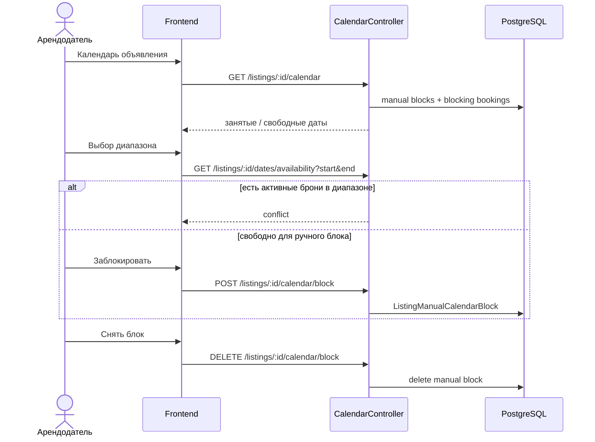

# UC-08 — Календарь объявления (ручные блоки)

**Статус:** реализовано

Автоблокировка дат при `POST /bookings` (CONFIRMED и др.) — через занятость в `Booking`, отдельного `notify_booking` API нет.
