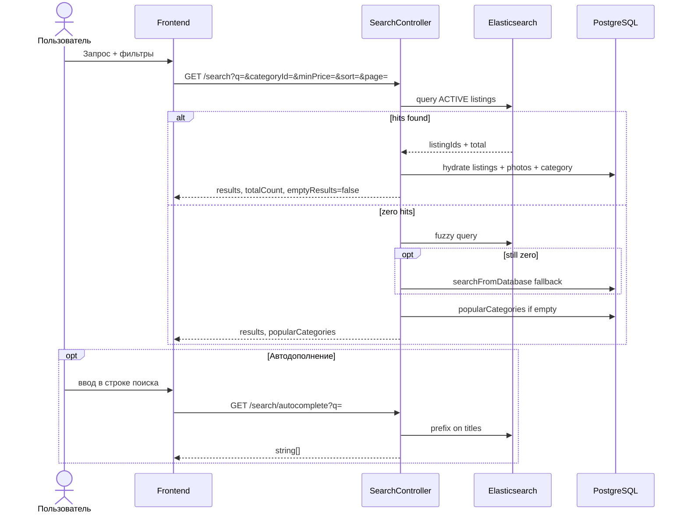

# UC-09 — Поиск в каталоге

**Статус:** реализовано

```mermaid
sequenceDiagram
    actor User as Пользователь
    participant WebApp as Frontend
    participant API as SearchController
    participant ES as Elasticsearch
    participant DB as PostgreSQL

    User->>WebApp: Запрос + фильтры
    WebApp->>API: GET /search?q=&categoryId=&minPrice=&sort=&page=

    API->>ES: query ACTIVE listings
  alt hits found
        ES-->>API: listingIds + total
        API->>DB: hydrate listings + photos + category
        API-->>WebApp: results, totalCount, emptyResults=false
    else zero hits
        API->>ES: fuzzy query
        opt still zero
            API->>DB: searchFromDatabase fallback
        end
        API->>DB: popularCategories if empty
        API-->>WebApp: results, popularCategories
    end

    opt Автодополнение
        User->>WebApp: ввод в строке поиска
        WebApp->>API: GET /search/autocomplete?q=
        API->>ES: prefix on titles
        API-->>WebApp: string[]
    end
```

Production: `CATALOG_DEFAULT_SEED_ENABLED=false` — демо-объявления не создаются.
