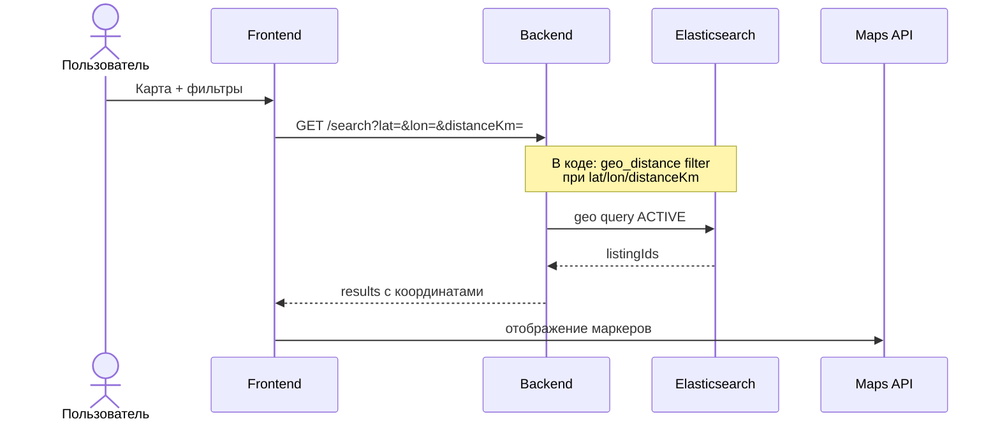

# UC-10 — Поиск на карте

**Статус:** запланировано

**Сейчас:** backend поддерживает geo-параметры в `GET /search`; отдельного экрана «карта» на фронте может не быть — уточняйте по Figma/репозиторию frontend.

Геокодирование адреса объявления: `POST /geo/geocode` (UC создания объявления).
