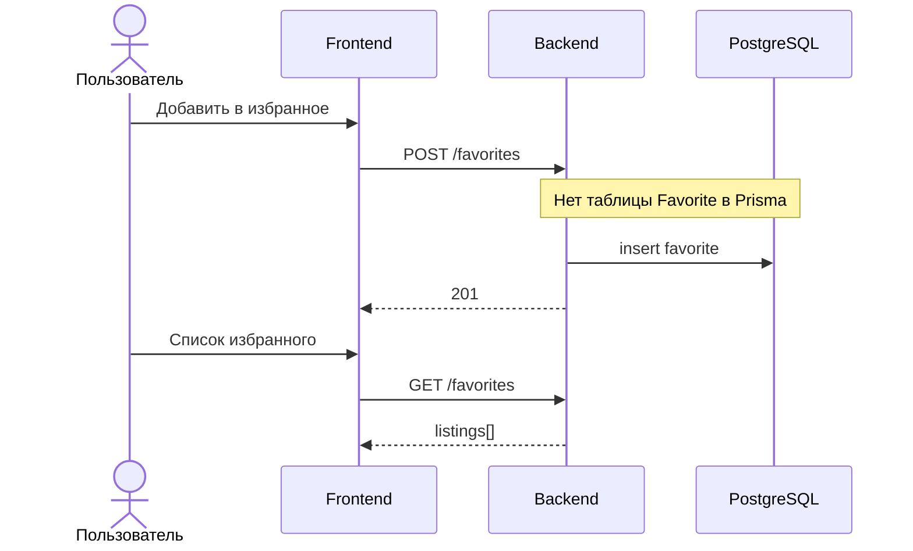

# UC-12 — Избранное

**Статус:** запланировано

```mermaid
sequenceDiagram
    actor User as Пользователь
    participant WebApp as Frontend
    participant API as Backend
    participant DB as PostgreSQL

    User->>WebApp: Добавить в избранное
    WebApp->>API: POST /favorites
    Note over API,DB: Нет таблицы Favorite в Prisma
    API->>DB: insert favorite
    API-->>WebApp: 201

    User->>WebApp: Список избранного
    WebApp->>API: GET /favorites
    API-->>WebApp: listings[]
```

На UI может быть иконка «сердце» без backend — проверьте `packages/frontend`.
