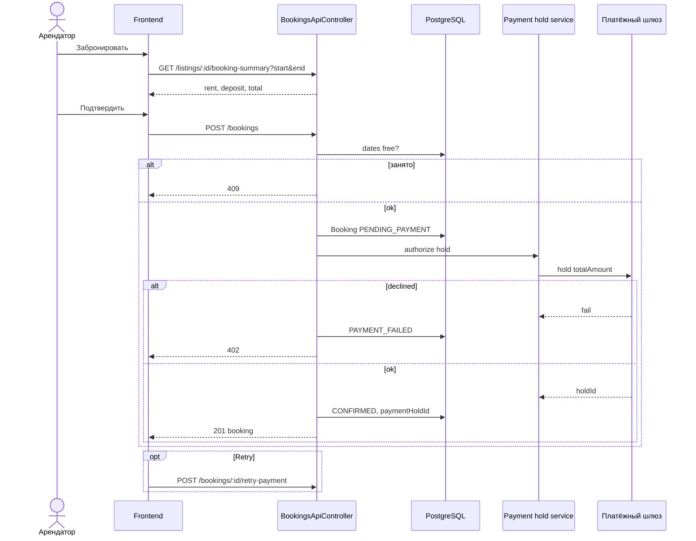

# UC-13 — Бронирование и холд оплаты

**Статус:** реализовано

```mermaid
sequenceDiagram
    actor Renter as Арендатор
    participant WebApp as Frontend
    participant API as BookingsApiController
    participant DB as PostgreSQL
    participant Pay as Payment hold service
    participant GW as Платёжный шлюз

    Renter->>WebApp: Забронировать
    WebApp->>API: GET /listings/:id/booking-summary?start&end
    API-->>WebApp: rent, deposit, total

    Renter->>WebApp: Подтвердить
    WebApp->>API: POST /bookings
    API->>DB: dates free?
    alt занято
        API-->>WebApp: 409
    else ok
        API->>DB: Booking PENDING_PAYMENT
        API->>Pay: authorize hold
        Pay->>GW: hold totalAmount
        alt declined
            GW-->>Pay: fail
            API->>DB: PAYMENT_FAILED
            API-->>WebApp: 402
        else ok
            GW-->>Pay: holdId
            API->>DB: CONFIRMED, paymentHoldId
            API-->>WebApp: 201 booking
        end
    end

    opt Retry
        WebApp->>API: POST /bookings/:id/retry-payment
    end
```

Состояния: [state/Booking.md](../state/Booking.md).
