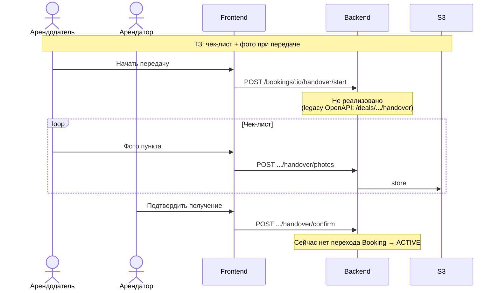

# UC-14 — Передача вещи (handover)

**Статус:** запланировано (в коде нет `/handover/*`)

```mermaid
sequenceDiagram
    actor Landlord as Арендодатель
    actor Renter as Арендатор
    participant WebApp as Frontend
    participant API as Backend
    participant S3 as S3

    Note over Landlord,S3: ТЗ: чек-лист + фото при передаче

    Landlord->>WebApp: Начать передачу
    WebApp->>API: POST /bookings/:id/handover/start
    Note over API: Не реализовано<br/>(legacy OpenAPI: /deals/.../handover)

    loop Чек-лист
        Landlord->>WebApp: Фото пункта
        WebApp->>API: POST .../handover/photos
        API->>S3: store
    end

    Renter->>WebApp: Подтвердить получение
    WebApp->>API: POST .../handover/confirm
    Note over API: Сейчас нет перехода Booking → ACTIVE
```

**Сейчас:** после холда бронь сразу `CONFIRMED`; отдельной фазы handover нет.
