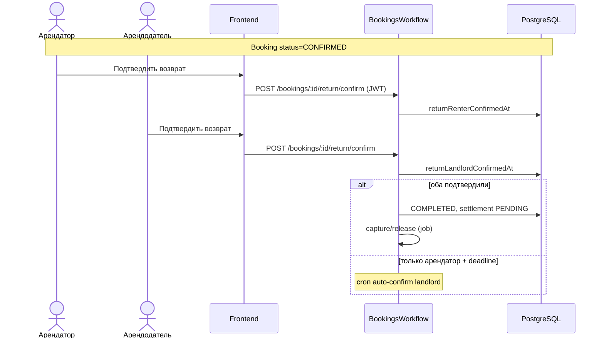

# UC-15 — Возврат вещи

**Статус:** частично (взаимное подтверждение без фото-чеклиста)

Фото при возврате, спор — **запланировано** (UC-14/19). Legacy путь: `/deals/{id}/return/*` → использовать `/bookings/{bookingId}/...`.
