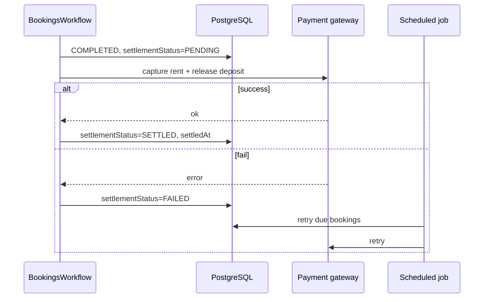

# UC-16 — Расчёт после возврата (settlement)

**Статус:** частично (поля settlement на Booking + cron retry)

Отдельной таблицы `Transaction` нет — см. [state/Transaction.md](../state/Transaction.md).
