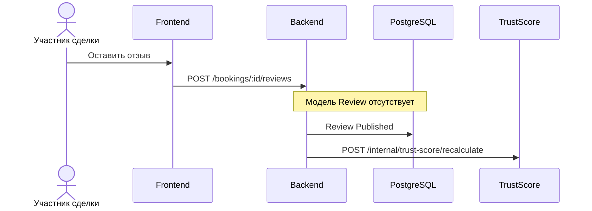

# UC-17 — Отзывы после сделки

**Статус:** запланировано

```mermaid
sequenceDiagram
    actor User as Участник сделки
    participant WebApp as Frontend
    participant API as Backend
    participant DB as PostgreSQL
    participant ARS as TrustScore

    User->>WebApp: Оставить отзыв
    WebApp->>API: POST /bookings/:id/reviews
    Note over API,DB: Модель Review отсутствует
    API->>DB: Review Published
    API->>ARS: POST /internal/trust-score/recalculate
```

**Сейчас:** `TrustScore` и internal recalculate есть; сущности `Review` нет.
