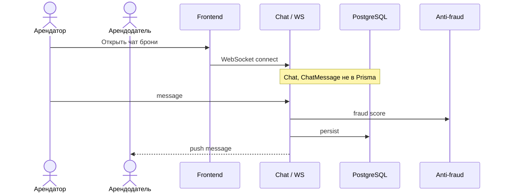

# UC-18 — Чат по сделке

**Статус:** запланировано

```mermaid
sequenceDiagram
    actor U1 as Арендатор
    actor U2 as Арендодатель
    participant WebApp as Frontend
    participant API as Chat / WS
    participant DB as PostgreSQL
    participant AI as Anti-fraud

    U1->>WebApp: Открыть чат брони
    WebApp->>API: WebSocket connect
    Note over API,DB: Chat, ChatMessage не в Prisma

    U1->>API: message
    API->>AI: fraud score
    API->>DB: persist
    API-->>U2: push message
```

В MVP общение вне платформы или через поддержку — по ТЗ.
