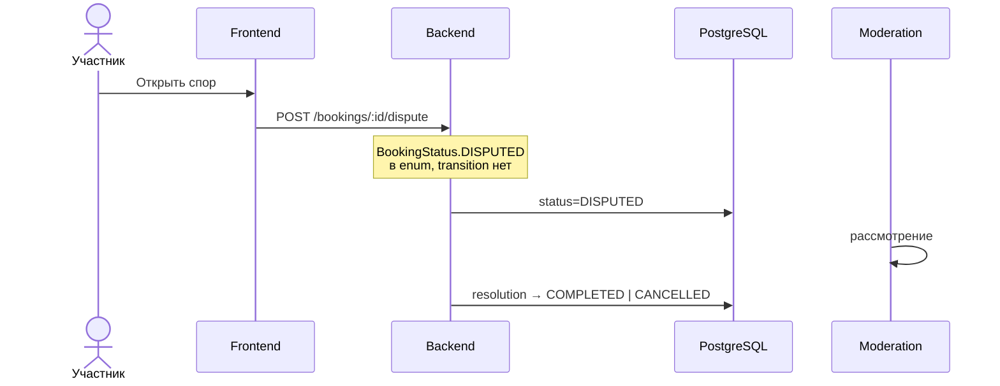

# UC-19 — Формальный спор

**Статус:** запланировано

**Сейчас:** отмена — `POST /bookings/:id/cancel`; возврат — `return/confirm` без ветки спора.

Состояния: [state/Dispute.md](../state/Dispute.md).
