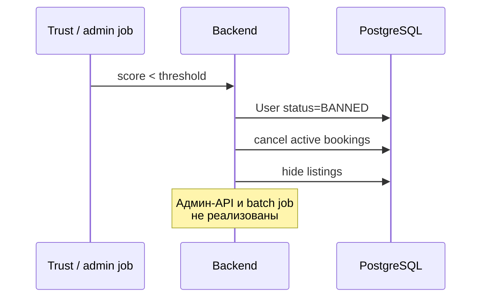

# UC-20 — Блокировка пользователя с низким ARS

**Статус:** запланировано (enum UserStatus BANNED/SUSPENDED; автоматики нет)

**Сейчас:** `BANNED`/`SUSPENDED` проверяются при Telegram-auth; массовой блокировки по ARS нет.
