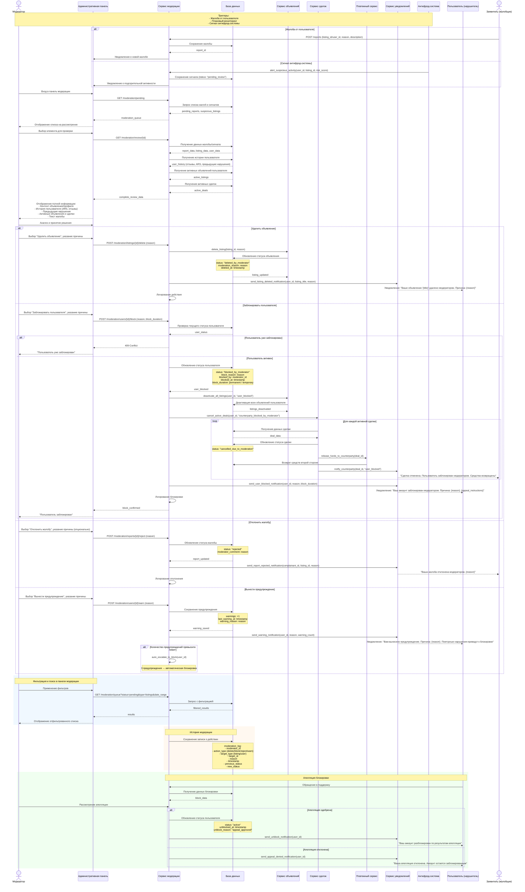

**Пост-MVP:** панель модерации, очередь и действия модератора не входят в минимальный продукт; для MVP публикация объявлений идёт сразу в `ACTIVE` после `publish` (см. UC-07).

```mermaid
    sequenceDiagram
    actor Moderator as Модератор
    participant AdminPanel as Административная панель
    participant ModerationService as Сервис модерации
    participant Database as База данных
    participant ListingService as Сервис объявлений
    participant DealService as Сервис сделок
    participant PaymentService as Платежный сервис
    participant NotifyService as Сервис уведомлений
    participant AntiFraudSystem as Антифрод-система
    participant User as Пользователь (нарушитель)
    actor Complainant as Заявитель (жалобщик)

    Note over Moderator,AntiFraudSystem: Триггеры:<br/>- Жалоба от пользователя<br/>- Плановый мониторинг<br/>- Сигнал антифрод-системы

    alt Жалоба от пользователя
        Complainant->>ModerationService: POST /reports (listing_id/user_id, reason, description)
        ModerationService->>Database: Сохранение жалобы
        Database-->>ModerationService: report_id
        ModerationService->>AdminPanel: Уведомление о новой жалобе
    else Сигнал антифрод-системы
        AntiFraudSystem->>ModerationService: alert_suspicious_activity(user_id, listing_id, risk_score)
        ModerationService->>Database: Сохранение сигнала (status: "pending_review")
        ModerationService->>AdminPanel: Уведомление о подозрительной активности
    end

    Moderator->>AdminPanel: Вход в панель модерации
    AdminPanel->>ModerationService: GET /moderation/pending
    ModerationService->>Database: Запрос списка жалоб и сигналов
    Database-->>ModerationService: pending_reports, suspicious_listings
    ModerationService-->>AdminPanel: moderation_queue
    AdminPanel-->>Moderator: Отображение списка на рассмотрение

    Moderator->>AdminPanel: Выбор элемента для проверки
    AdminPanel->>ModerationService: GET /moderation/review/{id}
    ModerationService->>Database: Получение данных жалобы/сигнала
    Database-->>ModerationService: report_data, listing_data, user_data
    
    ModerationService->>Database: Получение истории пользователя
    Database-->>ModerationService: user_history (отзывы, ARS, предыдущие нарушения)
    
    ModerationService->>Database: Получение активных объявлений пользователя
    Database-->>ModerationService: active_listings
    
    ModerationService->>Database: Получение активных сделок
    Database-->>ModerationService: active_deals
    
    ModerationService-->>AdminPanel: complete_review_data
    AdminPanel-->>Moderator: Отображение полной информации:<br/>- Контент объявления/профиля<br/>- История пользователя (ARS, отзывы)<br/>- Предыдущие нарушения<br/>- Активные объявления и сделки<br/>- Текст жалобы

    Moderator->>AdminPanel: Анализ и принятие решения
    
    alt Удалить объявление
        Moderator->>AdminPanel: Выбор "Удалить объявление", указание причины
        AdminPanel->>ModerationService: POST /moderation/listings/{id}/delete (reason)
        
        ModerationService->>ListingService: delete_listing(listing_id, reason)
        ListingService->>Database: Обновление статуса объявления
        Note over Database: status: "deleted_by_moderator"<br/>moderation_reason: reason<br/>deleted_at: timestamp
        Database-->>ListingService: listing_updated
        
        ModerationService->>NotifyService: send_listing_deleted_notification(user_id, listing_title, reason)
        NotifyService-->>User: Уведомление: "Ваше объявление '{title}' удалено модератором. Причина: {reason}"
        
        ModerationService->>ModerationService: Логирование действия
        
    else Заблокировать пользователя
        Moderator->>AdminPanel: Выбор "Заблокировать пользователя", указание причины
        AdminPanel->>ModerationService: POST /moderation/users/{id}/block (reason, block_duration)
        
        ModerationService->>Database: Проверка текущего статуса пользователя
        Database-->>ModerationService: user_status
        
        alt Пользователь уже заблокирован
            ModerationService-->>AdminPanel: 409 Conflict
            AdminPanel-->>Moderator: "Пользователь уже заблокирован"
        else Пользователь активен
            ModerationService->>Database: Обновление статуса пользователя
            Note over Database: status: "blocked_by_moderator"<br/>block_reason: reason<br/>blocked_by: moderator_id<br/>blocked_at: timestamp<br/>block_duration: permanent / temporary
            Database-->>ModerationService: user_blocked
            
            ModerationService->>ListingService: deactivate_all_listings(user_id, "user_blocked")
            ListingService->>Database: Деактивация всех объявлений пользователя
            Database-->>ListingService: listings_deactivated
            
            ModerationService->>DealService: cancel_active_deals(user_id, "counterparty_blocked_by_moderator")
            
            loop Для каждой активной сделки
                DealService->>Database: Получение данных сделки
                Database-->>DealService: deal_data
                DealService->>Database: Обновление статуса сделки
                Note over Database: status: "cancelled_due_to_moderation"
                DealService->>PaymentService: release_funds_to_counterparty(deal_id)
                PaymentService->>Database: Возврат средств второй стороне
                DealService->>NotifyService: notify_counterparty(deal_id, "user_blocked")
                NotifyService-->>Complainant: "Сделка отменена. Пользователь заблокирован модератором. Средства возвращены"
            end
            
            ModerationService->>NotifyService: send_user_blocked_notification(user_id, reason, block_duration)
            NotifyService-->>User: Уведомление: "Ваш аккаунт заблокирован модератором. Причина: {reason}. {appeal_instructions}"
            
            ModerationService->>ModerationService: Логирование блокировки
            
            ModerationService-->>AdminPanel: block_confirmed
            AdminPanel-->>Moderator: "Пользователь заблокирован"
        end
        
    else Отклонить жалобу
        Moderator->>AdminPanel: Выбор "Отклонить жалобу", указание причины (опционально)
        AdminPanel->>ModerationService: POST /moderation/reports/{id}/reject (reason)
        
        ModerationService->>Database: Обновление статуса жалобы
        Note over Database: status: "rejected"<br/>moderator_comment: reason
        Database-->>ModerationService: report_updated
        
        ModerationService->>NotifyService: send_report_rejected_notification(complainant_id, listing_id, reason)
        NotifyService-->>Complainant: "Ваша жалоба отклонена модератором. {reason}"
        
        ModerationService->>ModerationService: Логирование отклонения
        
    else Вынести предупреждение
        Moderator->>AdminPanel: Выбор "Вынести предупреждение", указание причины
        AdminPanel->>ModerationService: POST /moderation/users/{id}/warn (reason)
        
        ModerationService->>Database: Сохранение предупреждения
        Note over Database: warnings: +1<br/>last_warning_at: timestamp<br/>warning_reason: reason
        Database-->>ModerationService: warning_saved
        
        ModerationService->>NotifyService: send_warning_notification(user_id, reason, warning_count)
        NotifyService-->>User: Уведомление: "Вам вынесено предупреждение. Причина: {reason}. Повторные нарушения приведут к блокировке"
        
        alt Количество предупреждений превысило лимит
            ModerationService->>ModerationService: auto_escalate_to_block(user_id)
            Note over ModerationService: 3 предупреждения → автоматическая блокировка
        end
    end

    rect rgb(240, 248, 255)
        Note over Moderator,AdminPanel: Фильтрация и поиск в панели модерации
        
        Moderator->>AdminPanel: Применение фильтров
        AdminPanel->>ModerationService: GET /moderation/queue?status=pending&type=listings&date_range
        ModerationService->>Database: Запрос с фильтрацией
        Database-->>ModerationService: filtered_results
        ModerationService-->>AdminPanel: results
        AdminPanel-->>Moderator: Отображение отфильтрованного списка
    end
    
    rect rgb(255, 248, 240)
        Note over ModerationService,Database: История модерации
        
        ModerationService->>Database: Сохранение записи о действии
        Note over Database: moderation_log:<br/>- moderator_id<br/>- action_type (delete/block/reject/warn)<br/>- target_type (listing/user)<br/>- target_id<br/>- reason<br/>- timestamp<br/>- previous_status<br/>- new_status
    end
    
    rect rgb(240, 255, 240)
        Note over ModerationService,User: Апелляция блокировки
        
        User->>ModerationService: Обращение в поддержку
        ModerationService->>Database: Получение данных блокировки
        Database-->>ModerationService: block_data
        
        Moderator->>ModerationService: Рассмотрение апелляции
        
        alt Апелляция одобрена
            ModerationService->>Database: Обновление статуса пользователя
            Note over Database: status: "active"<br/>unblocked_at: timestamp<br/>unblock_reason: "appeal_approved"
            ModerationService->>NotifyService: send_unblock_notification(user_id)
            NotifyService-->>User: "Ваш аккаунт разблокирован по результатам апелляции"
        else Апелляция отклонена
            ModerationService->>NotifyService: send_appeal_denied_notification(user_id)
            NotifyService-->>User: "Ваша апелляция отклонена. Аккаунт остается заблокированным"
        end
    end

```