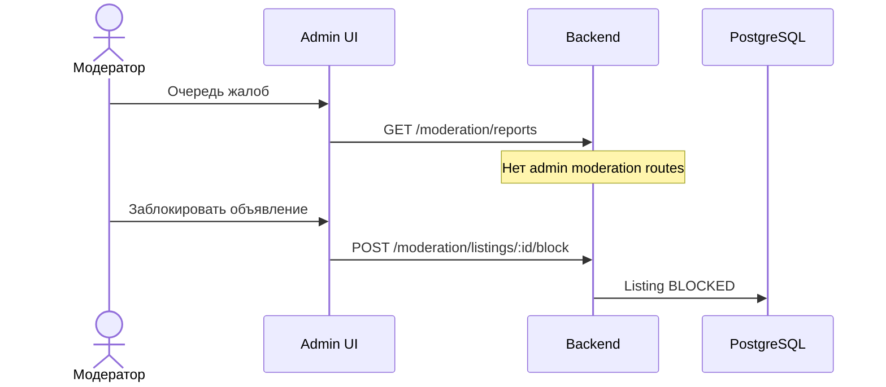

# UC-21 — Панель модератора

**Статус:** запланировано

**Сейчас:** автомодерация **текста** при create/update/publish (rules + Ollama). Health: `GET /health/moderation-llm`. См. [moderation-draft-ai.md](../moderation-draft-ai.md).
