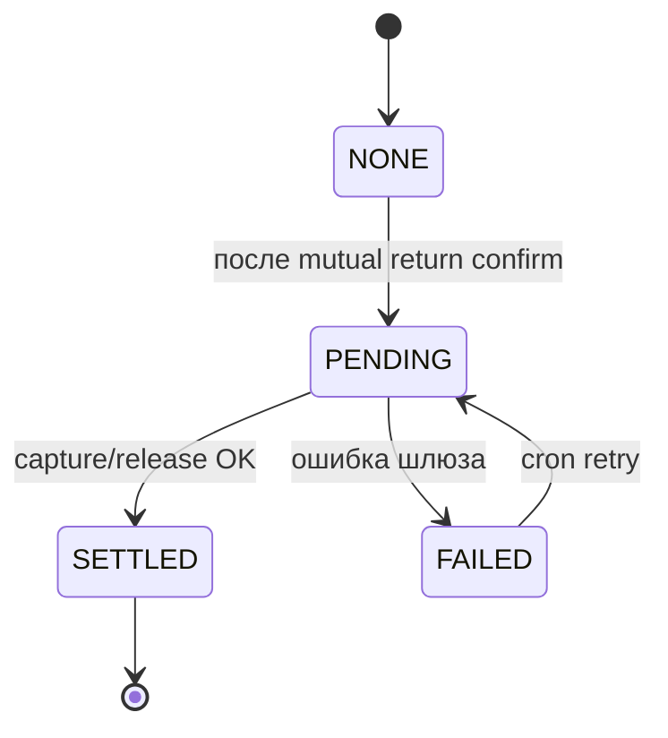

# Booking — статусы бронирования

**Источник:** `BookingStatus`, `BookingSettlementStatus` в Prisma  
**Реализованные переходы** — `bookings-workflow.service.ts`.

```mermaid
stateDiagram-v2
    [*] --> PENDING_PAYMENT: POST /bookings

    PENDING_PAYMENT --> CONFIRMED: холд оплаты OK
    PENDING_PAYMENT --> PAYMENT_FAILED: отказ банка / шлюза

    PAYMENT_FAILED --> CONFIRMED: POST /bookings/:id/retry-payment OK
    PAYMENT_FAILED --> PAYMENT_FAILED: retry неудачен

    CONFIRMED --> COMPLETED: POST /bookings/:id/return/confirm<br/>(оба подтвердили или авто по cron)
    CONFIRMED --> CANCELLED: POST /bookings/:id/cancel

    PENDING_PAYMENT --> CANCELLED: cancel
    PAYMENT_FAILED --> CANCELLED: cancel

    COMPLETED --> [*]

    note right of PENDING
        Default в Prisma;
        create сразу ставит PENDING_PAYMENT
    end note

    note right of ACTIVE
        Enum в схеме;
        переход в коде не выполняется
    end note

    note right of DISPUTED
        Enum в схеме;
        учитывается в календаре как блокирующий;
        workflow спора — запланирован
    end note
```

## Settlement (подстатус платежа)



## Календарь

Даты заняты бронями в статусах: `PENDING`, `PENDING_PAYMENT`, `CONFIRMED`, `ACTIVE`, `DISPUTED` (+ ручные блоки владельца).
