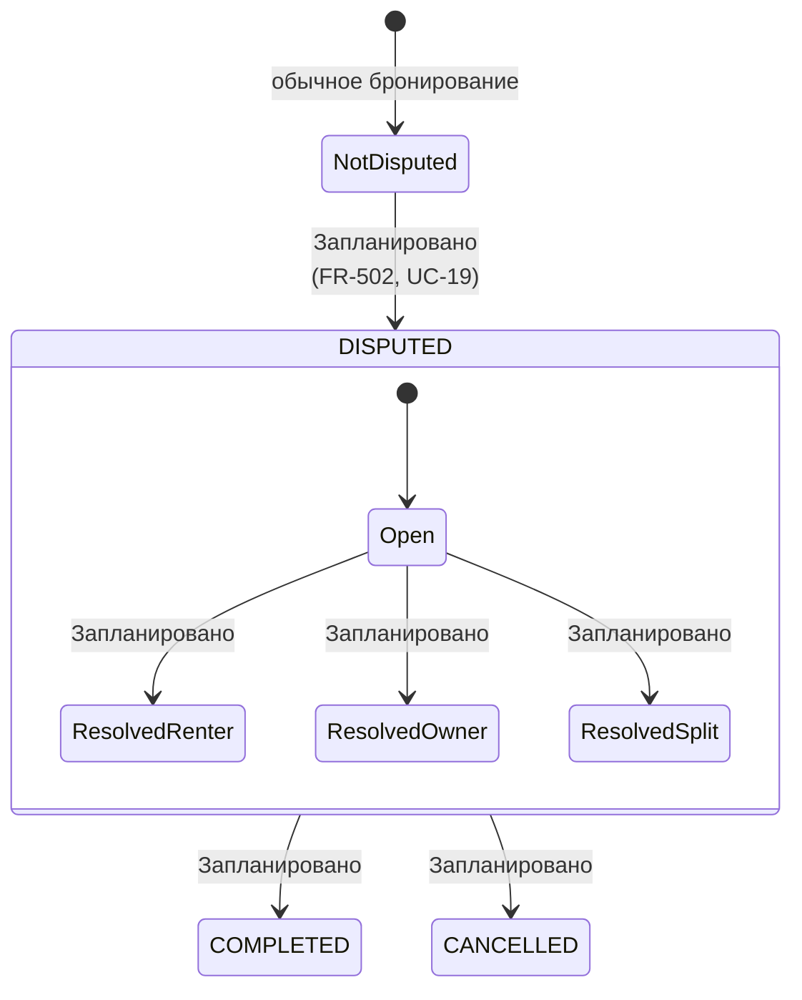

# Dispute — спор по бронированию

**Статус в коде:** `BookingStatus.DISPUTED` объявлен в Prisma и учитывается при блокировке дат календаря, но **переход в `DISPUTED` в workflow не реализован**.

**Реализовано сейчас:** взаимное подтверждение возврата без спора — `POST /bookings/:bookingId/return/confirm` → `COMPLETED` (см. [Booking.md](Booking.md), UC-15).

**Legacy в OpenAPI:** пути `/deals/{dealId}/...` — в NestJS используйте `/bookings/{bookingId}/...`.
