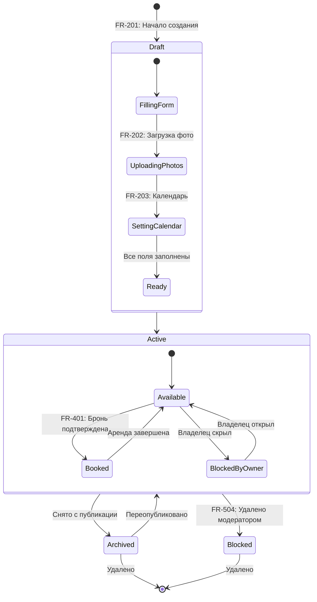

**MVP:** переход `Draft` → `Active` без промежуточной очереди модерации. Переход в `Blocked` по действию модератора (FR-504) — **будущий этап** / не обязателен для первого релиза.

```mermaid
    stateDiagram-v2
    [*] --> Draft: FR-201: Начало создания

    state Draft {
        [*] --> FillingForm
        FillingForm --> UploadingPhotos: FR-202: Загрузка фото
        UploadingPhotos --> SettingCalendar: FR-203: Календарь
        SettingCalendar --> Ready: Все поля заполнены
    }
   
    Draft --> Active
   
    state Active {
        [*] --> Available
        Available --> Booked: FR-401: Бронь подтверждена
        Booked --> Available: Аренда завершена
        Available --> BlockedByOwner: Владелец скрыл
        BlockedByOwner --> Available: Владелец открыл
    }
   
    Active --> Archived: Снято с публикации
    Active --> Blocked: FR-504: Удалено модератором
   
    Archived --> Active: Переопубликовано
    Archived --> [*]: Удалено
   
    Blocked --> [*]: Удалено

```