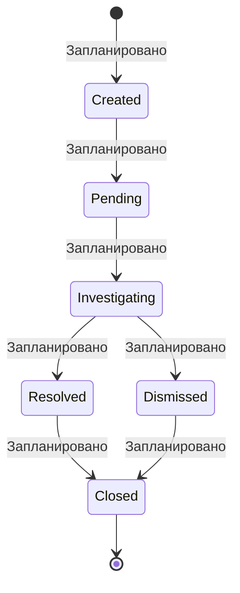

# Report — жалобы на контент

**Статус в коде:** не реализовано (нет модели `Report` в Prisma, нет панели модератора UC-21).

**Реализованная модерация сейчас:** только автоматическая проверка **текста объявления** (rules + LLM), см. [moderation-draft-ai.md](../moderation-draft-ai.md).
