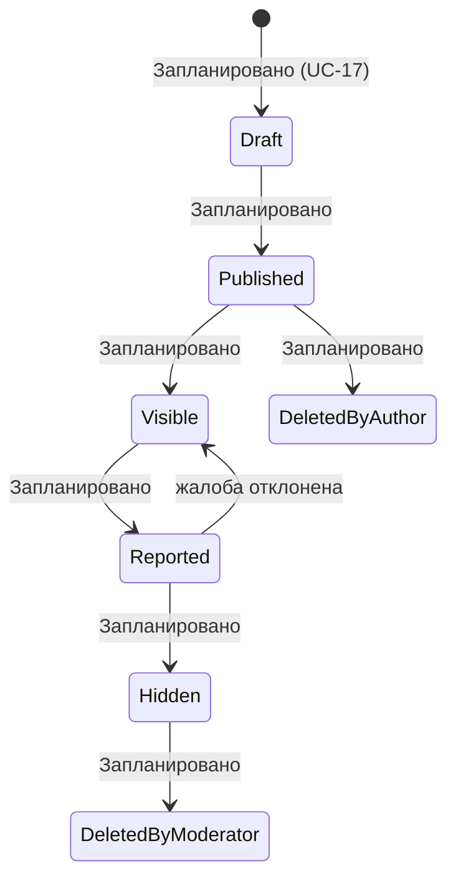

# Review — отзывы после сделки

**Статус в коде:** не реализовано (нет модели `Review` в Prisma).

**Связь с ARS:** пересчёт `TrustScore` — `POST /internal/trust-score/recalculate` (внутренний API, реализован).
