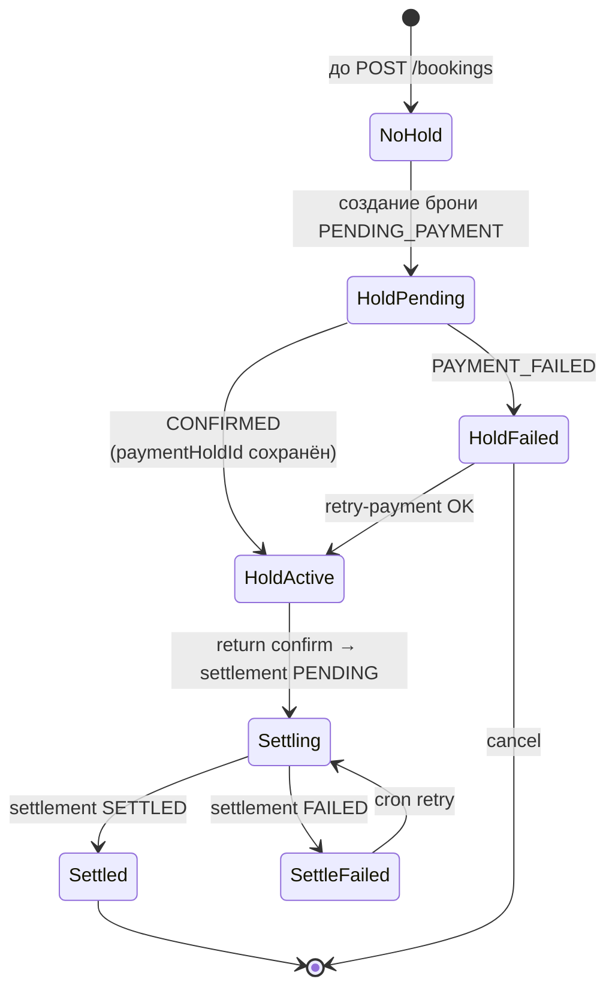

# Платёж / холд по бронированию

Отдельной таблицы `Transaction` в Prisma **нет**. Финансовое состояние хранится в **`Booking`**: `amountHeld`, `paymentHoldId`, `paymentGateway`, `settlementStatus`.

**Запланировано (ТЗ):** отдельная сущность escrow-транзакций, частичные release, спор → refund — в текущем коде упрощено до полей брони и settlement job.
