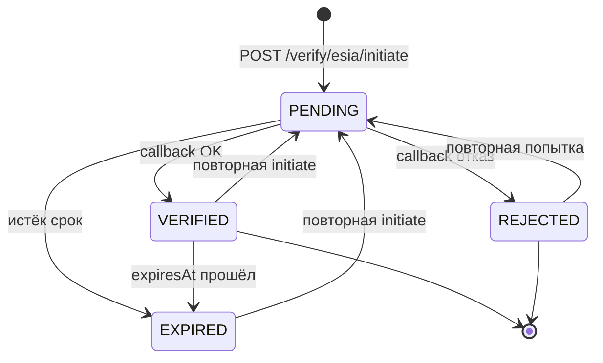

# IdentityVerification — верификация (ЕСИА)

**Источник:** модель `IdentityVerification`, enum `IdentityVerificationStatus`  
**Реализовано:** `POST /verify/esia/initiate`, `GET /verify/esia/callback`, stub для dev.

Связь с пользователем: `User.identityVerification` (1:1). Бейдж «проверенный» на фронте зависит от `status === VERIFIED`.

Дополнительно: `POST /verify/esia/escalate` — эскалация сценария (см. контроллер).
